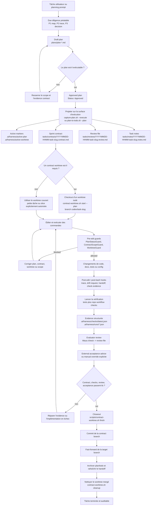
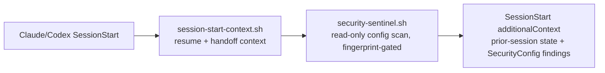
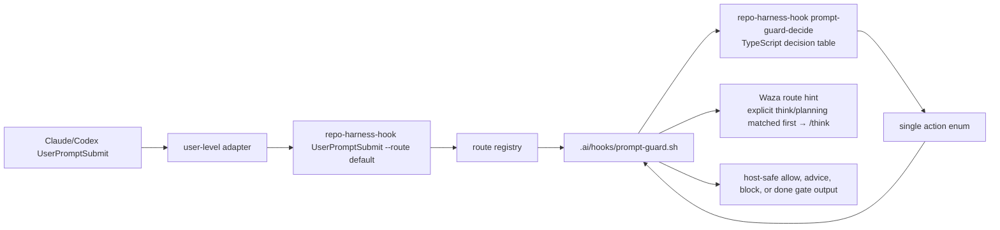

# repo-harness

Harness CLI de développement agentique repo-local et skill runtime pour les
workflows Claude/Codex.

[English](README.md) | [简体中文](README.zh-CN.md) | [日本語](README.ja.md) | [Français](README.fr.md) | [Español](README.es.md)

Adresse du dépôt : `https://github.com/Ancienttwo/repo-harness`

`repo-harness` est un harness de workflow qui matérialise le processus de
programmation par IA dans les fichiers du dépôt. C'est à la fois le dépôt source
du CLI `repo-harness` et de son skill runtime, et un exemple auto-hébergé du
workflow repo-local qu'il génère lui-même pour les projets en aval.

## Pourquoi utiliser repo-harness

- **L'état de session vit dans les fichiers, pas dans l'historique de chat.** Des
  sessions d'agent distinctes — Claude, Codex, maintenant ou plus tard — restent
  synchronisées via le dépôt et non via un thread de conversation. Au démarrage
  d'une nouvelle session, `.ai/hooks/session-start-context.sh` injecte le resume
  packet de la session précédente (`.ai/harness/handoff/resume.md`,
  `tasks/current.md`) ; à la fin de la session et après chaque édition,
  `finalize-handoff.sh` et `post-edit-guard.sh` réécrivent le handoff suivant. Une
  tâche peut s'interrompre en cours de route, et la session suivante reprend
  directement avec l'étape suivante exacte, les points de blocage et les fichiers
  modifiés, sans avoir à les redéduire.
- **Économe en tokens par conception.** Au lieu de boucles grep+read qui
  rescannent le dépôt à chaque session, le harness s'appuie sur un index CodeGraph
  pré-construit pour les requêtes structurelles (qui appelle, qui est appelé, où
  c'est défini), puis sur un chargement de contexte progressif via
  `.ai/context/context-map.json` et `capabilities.json` : un root context petit et
  stable (environ 12 Ko), plus des blocs capability chargés uniquement quand les
  fichiers que vous touchez en ont besoin. Un agent lit un contrat capability de
  1 Ko ou interroge l'index, au lieu de dépenser des milliers de tokens à
  redécouvrir la structure.

## Nouveautés de la 0.2.1

- **Commande d'initialisation globale (`repo-harness init`).** Une seule commande
  amorce l'environnement Claude global : essential plugins,
  policy hooks configurables (worktree guard, atomic commit/pending), LSP plugins
  optionnels selon le type de projet, et quatre hook profiles (`standard`,
  `minimal`, `biome`, `biome-strict`). Exécutez
  `npx -y repo-harness init` ; aucun clone du dépôt source n'est nécessaire.
- **Commande de rafraîchissement du dépôt (`repo-harness update`).** L'installation
  et le rafraîchissement des dépôts existants ont leur propre surface de commande,
  tout en conservant l'ancien chemin de migration repo-local et en gardant `init`
  dédié au runtime global.
- **Auto-réparation de l'index CodeGraph.** Quand le prompt hook détecte une
  intention de navigation structurelle et que le dépôt n'a pas d'index
  `.codegraph`, il initialise l'index avec le binaire CodeGraph local ou visible
  dans PATH avant d'émettre l'indication de route. Cela reste advisory : pas
  d'installation de dépendances, pas de readiness probe lourd, et pas de blocage
  du prompt si CodeGraph est indisponible.
- **Sentinelle de sécurité (`repo-harness security scan` +
  `security-sentinel.sh`).** Une vérification en lecture seule sur les surfaces
  d'injection de configuration à forte valeur (`~/.claude/settings.json`,
  `~/.codex/hooks.json`, le `.vscode/tasks.json` repo-local, ainsi que les adapter
  legacy de niveau projet `.claude`/`.codex`). Elle signale les motifs de commandes
  dangereux — pipes vers un remote shell, base64 décodé puis exécuté, `osascript`,
  persistance via `launchctl`/`crontab`, netcat, exécution d'interpréteur inline —
  ainsi que les hooks non gérés et les tâches `folderOpen` auto-exécutées, et elle
  ne réécrit jamais aucune configuration. La sentinelle `SessionStart` calcule une
  empreinte de cet ensemble de fichiers et ne rescanne que lorsque l'empreinte
  change, sans produire de bruit au démarrage de session. Audit à la demande :
  `repo-harness security scan --json`.
- **Cycle de vie draft-plan Claude/Codex.** Le Plan mode se divise explicitement en
  deux étapes : Draft et Approved. Les hooks détectent l'intention de créer un plan
  et suivent le pending orchestration ; le stop gate (`stop-orchestrator.sh`) exige
  que la session fasse une passe d'auto-review avant de se terminer alors qu'un plan
  n'est pas finalisé. Capturez un brouillon avec
  `scripts/capture-plan.sh --slug <slug> --title <title> --status Draft`, puis
  passez en Approved après validation et projetez-le dans l'exécution avec
  `--execute` ou `scripts/plan-to-todo.sh --plan <plan>`. plans/ devient la source
  de vérité au niveau fichier.

## Ce que fait le produit

`repo-harness` fait passer le développement assisté par IA d'une « coordination
verbale dans l'historique de chat » à un « état repo-local auditable ». Il
installe dans le dépôt cible un ensemble de contrats de fichiers petit et
explicite, pour que Claude, Codex et les humains partagent une même source de
vérité sur les points suivants :

- quelle est l'intention produit stable
- quel plan est approuvé pour passer en exécution
- quels périmètres le sprint contract courant autorise à modifier
- quels checks, review et evidence prouvent que la tâche est réellement terminée
- comment les hooks doivent avertir, bloquer, enregistrer les traces et faire le
  handoff entre sessions

Ce n'est pas un agent gateway, un runtime produit, un service de base de données
ni un MCP server. La frontière du produit est claire : inspecter le dépôt cible,
installer ou rafraîchir les fichiers de workflow, router les host events de
Claude/Codex vers les hooks repo-local, puis vérifier que ces workflow surfaces
restent cohérentes.

## Comment ça marche

L'ensemble se découpe en trois couches :

1. **Couche package source** : ce dépôt maintient le CLI, les command skill
   facades, les templates, les hook assets, le workflow contract, les tests et le
   release gate.
2. **Couche contrat du dépôt cible** : `repo-harness update` ou une migration écrit
   `docs/spec.md`, `plans/`, `tasks/`, `.ai/context/`, `.ai/harness/`, les helper
   scripts et `.ai/hooks/`.
3. **Couche host adapter** : les `~/.claude/settings.json` et `~/.codex/hooks.json`
   de niveau utilisateur routent les events Claude/Codex vers `repo-harness-hook`.
   Le hook entrypoint vérifie d'abord si le dépôt courant possède un
   `.ai/harness/workflow-contract.json` ; sans opt in, il sort silencieusement, et
   ce n'est qu'avec opt in qu'il entre dans les `.ai/hooks/*` du dépôt courant.

Pour `UserPromptSubmit`, l'adapter contract public reste
`repo-harness-hook UserPromptSubmit --route default`. La route registry du CLI
dispatche cette route vers `.ai/hooks/prompt-guard.sh`. Le shell hook continue
d'assurer le parsing du host JSON, la lecture des fichiers de workflow, les
effets de bord de plan capture, le rendu du quality gate, ainsi qu'un
stdout/stderr host-safe. La décision sur le prompt intent et le workflow state
est confiée au TypeScript decision engine derrière
`repo-harness-hook prompt-guard-decide` ; il renvoie un action enum depuis une
decision table explicite. Ainsi, la configuration du host reste inchangée, mais
la couche classifier/state-machine, la plus sujette aux erreurs, n'est plus
éparpillée dans des branches conditionnelles de shell.

Invariant central : les faits persistants vivent dans le dépôt, pas dans la
fenêtre de chat. Les hooks ne sont que des accélérateurs et des guardrails ;
l'authority réelle, ce sont les fichiers de plan, contract, review, checks et
handoff.

## Task Workflow : de Plan à Closeout

Le diagramme ci-dessous suppose que le harness est déjà installé dans le dépôt
cible. Il montre le cycle normal d'une tâche unique : d'abord former un plan,
puis le projeter dans le sprint contract, faire un checkout d'un worktree isolé
si nécessaire, implémenter sous la protection des hooks, puis vérifier, review,
external acceptance, et enfin closeout.



## Les 5 premières minutes

C'est le chemin le plus rapide pour évaluer si un dépôt réel se prête à l'adoption
de ce workflow.

### Installer ou rafraîchir le runtime local

```bash
npx -y repo-harness init
```

La release line du package npm est désormais `0.2.x` ; la generated workflow
compatibility model line est suivie séparément en `5.x`. `repo-harness init`
sert au bootstrap global et `repo-harness update` sert au rafraîchissement
repo-local. `repo-harness init` configure le CLI, les hook adapters de niveau
utilisateur, Waza, Mermaid, le brain root et CodeGraph MCP ; l'ancien chemin
Claude plugin `scripts/setup-plugins.sh` est retiré.

Si vous travaillez depuis un checkout source :

```bash
git clone https://github.com/Ancienttwo/repo-harness.git ~/Projects/repo-harness
cd ~/Projects/repo-harness
bun src/cli/index.ts init
```

Modèle de chemins locaux :

- Dépôt source : `~/Projects/repo-harness`
- Claude skill aliases : `~/.claude/skills/repo-harness`, `~/.claude/skills/repo-harness-skill`
- Codex discoverable skill alias : `~/.codex/skills/repo-harness`
- Codex compatibility fallback alias : `~/.codex/skills/repo-harness-skill`

`~/Projects/repo-harness` est l'unique source of truth éditable. Les chemins
Claude/Codex locaux sont des runtime entrypoints adossés à des symlinks. Les
répertoires du runtime `project-initializer` retiré sont nettoyés par
`scripts/sync-codex-installed-copies.sh`.

### Prérequis minimaux

- Un Git working tree
- `bash`
- `bun`, pour la vérification ultérieure et le template assembly
- `jq` est optionnel ; recommandé pour `--dry-run`, et encore plus utile lors de
  l'application d'un settings merge

### Démarrer ici

Pour un dépôt existant, exécutez depuis le repo root :

```bash
npx -y repo-harness update --dry-run
```

Appliquez seulement une fois que le rapport du dry-run est correct :

```bash
npx -y repo-harness update
```

Pour un nouveau projet ou un nouveau module, utilisez la branch command
`repo-harness-scaffold`. Pour un dépôt existant, utilisez `repo-harness update` ;
il installe ou rafraîchit le harness sans créer de stack applicatif.

### À quoi ressemble le succès

La commande doit se terminer par `=== Migration Report ===` et inclure :

- `Project hooks synced from:` : d'où vient le comportement des hooks générés
- `Host hook config target: user-level ~/.claude/settings.json and ~/.codex/hooks.json` : où se trouve la couche adapter
- `Host hook adapters are user-level:` : rappel d'installer les global adapters, et de faire confiance à `~/.codex/hooks.json`
- `Workflow migration:` : le plan de création ou de rafraîchissement des repo-local harness surfaces
- `Helper scripts:` : la chaîne d'outils opérationnels obtenue après application
- `--- External Tooling ---` : le routing gstack/Waza/gbrain ainsi que les conseils d'installation/mise à jour advisory

### Les deux commandes à lancer ensuite

```bash
bash scripts/check-task-workflow.sh --strict
bun test
```

Si la sortie du dry-run est incorrecte, arrêtez-vous ici et lisez
[`docs/reference-configs/hook-operations.md`](docs/reference-configs/hook-operations.md).

## Hook Authority Map

- `.ai/hooks/` est l'unique shared hook implementation qu'il faut éditer en priorité.
- `~/.claude/settings.json` est l'adapter Claude de niveau utilisateur, chargé de dispatcher vers les opted-in repos.
- `~/.codex/hooks.json` est l'adapter Codex de niveau utilisateur, qui dispatche vers le même runner.
- Les hook adapters repo-local `.claude/settings.json` et `.codex/hooks.json` sont une legacy project-level config et doivent être retirés lors de la migration.
- Codex doit faire confiance à `~/.codex/hooks.json` dans Settings pour que les hooks s'exécutent.
- Ordre de débogage : user-level adapter config -> `repo-harness-hook` ou fallback `repo-harness hook` -> route registry -> `.ai/hooks/*`.

`SessionStart` exécute deux scripts ordonnés avant le début du travail :



Le prompt guard ajoute une étape interne supplémentaire :



La couche shell conserve l'authority sur le filesystem et les effets de bord. Le
TypeScript ne possède que le classifier plus la decision table
`intent x plan state`.

## Hook Failure Playbook

Quand un hook block fonctionne, regardez d'abord la sortie structurée dans le
terminal. Les champs clés sont `guard`, `reason`, `fix`, `failure_class` et
`run_id`.

- Failure log : `.ai/harness/failures/latest.jsonl`
- Trace log : `.claude/.trace.jsonl`
- Guide approfondi : [`docs/reference-configs/hook-operations.md`](docs/reference-configs/hook-operations.md)

Guards courants :

- `PlanStatusGuard` : pas d'active plan, ou le plan n'est pas encore exécutable
- `ContractGuard` : une approved execution n'a pas encore généré le scaffold contract/review/notes
- `ContractGuard` : la tâche est déclarée terminée avant d'avoir passé la contract verification
- `WorktreeGuard` : écriture depuis le primary worktree alors que la politique des linked worktrees est appliquée

## Repo Workflow

- Root routing docs : `CLAUDE.md`, `AGENTS.md`
- Shared hook layer : `.ai/hooks/`
- User-level adapter layer : `~/.claude/settings.json`, `~/.codex/hooks.json`
- Active execution surface : `tasks/`
- Plan source of truth : `plans/`
- Durable progress : `tasks/workstreams/`
- Release history : `docs/CHANGELOG.md`

## Release actuelle

- npm package : `repo-harness@0.2.1`
- Generated workflow compatibility : `5.2.3`
- GitHub repository : `Ancienttwo/repo-harness`
- Release history : [`docs/CHANGELOG.md`](docs/CHANGELOG.md)

## Current Model (5.2.3)

- Le question flow utilise **12 grouped decision points**, en inférant d'abord les harness defaults.
- Le plan menu est hiérarchisé : **Core Plans (A-F)** en priorité, **Custom Presets (G-K)** uniquement quand c'est nécessaire.
- Le skill routing est inspection-first :
  - `scripts/inspect-project-state.ts`
  - `scripts/migrate-workflow-docs.ts`
  - `assets/workflow-contract.v1.json`
- Les generated repos utilisent par défaut le repo-local harness flow :
  - `docs/spec.md -> plans/ -> tasks/contracts/ -> tasks/reviews/ -> .ai/context/context-map.json -> .ai/harness/*`
- `repo-harness update` rafraîchit les runtime pieces :
  - les `repo-harness` skill aliases
  - les global Codex/Claude hook adapters
  - les Waza skills : `think`, `hunt`, `check`, `health`
  - Mermaid
- Les autres outils externes restent advisory-only :
  - `bash scripts/check-agent-tooling.sh --host both --check-updates`
  - pas de configuration automatique de gstack, gbrain, CodeGraph MCP, daemon ou provider

## Action Command Skills

Les command facades publics se trouvent dans `assets/skill-commands/` ; ils
préservent la découverte par skills, tandis que l'exécution appartient au CLI et
aux hooks :

- Planning / review : `repo-harness-plan`, `repo-harness-review`, `repo-harness-autoplan`
- Repo workflow actions : `repo-harness-ship`, `repo-harness-init`, `repo-harness-migrate`, `repo-harness-upgrade`, `repo-harness-capability`, `repo-harness-architecture`, `repo-harness-handoff`, `repo-harness-deploy`, `repo-harness-repair`, `repo-harness-check`
- Branch project creation : `repo-harness-scaffold`

`repo-harness update` sert aux dépôts existants ; `repo-harness-scaffold` sert de
branch command pour créer un nouveau projet ou module. `hooks-init`, `docs-init` et
`create-project-dirs` sont des étapes internes, pas des commands publiques.

## Maintainer Reference

### Vérifier le workflow contract de ce dépôt

```bash
bash scripts/check-task-sync.sh
bash scripts/check-task-workflow.sh --strict
bun scripts/inspect-project-state.ts --repo . --format text
bash scripts/migrate-project-template.sh --repo . --dry-run
```

### Template assembly

```bash
bun scripts/assemble-template.ts --plan C --name "MyProject"
bun scripts/assemble-template.ts --target agents --plan C --name "MyProject"
```

### Verification

```bash
bun test
bash scripts/check-task-sync.sh
bash scripts/check-task-workflow.sh --strict
bun scripts/inspect-project-state.ts --repo . --format text
bash scripts/migrate-project-template.sh --repo . --dry-run
bash scripts/check-agent-tooling.sh --host both --check-updates
bun run benchmark:skills --dry-run
```

## Key Files

- Skill spec : `SKILL.md`
- Root routing docs : `CLAUDE.md`, `AGENTS.md`
- Plan mapping : `assets/plan-map.json`
- Question-pack : `assets/initializer-question-pack.v4.json`
- Shared hooks : `assets/hooks/`
- Workflow contract : `assets/workflow-contract.v1.json`
- Hook operations reference : `docs/reference-configs/hook-operations.md`
- Template assembler : `scripts/assemble-template.ts`
- State inspector : `scripts/inspect-project-state.ts`
- Legacy-doc migrator : `scripts/migrate-workflow-docs.ts`
