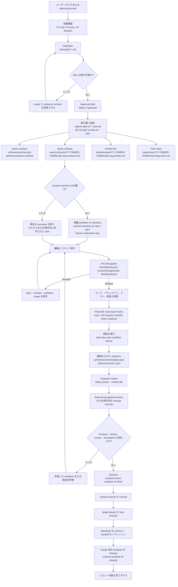
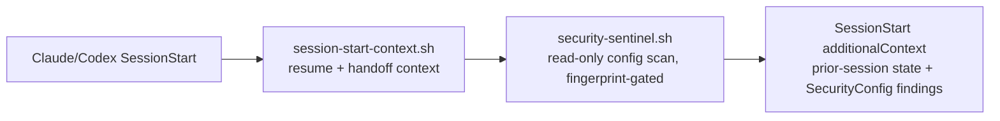
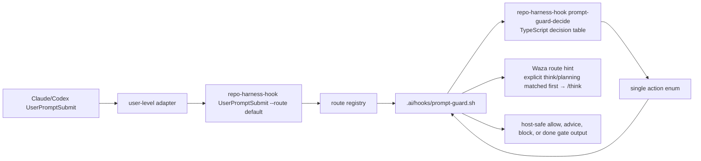

# repo-harness

Claude/Codex の workflow 向けに、repo-local な agentic development harness の CLI と
skill runtime を提供します。

[English](README.md) | [简体中文](README.zh-CN.md) | [日本語](README.ja.md) | [Français](README.fr.md) | [Español](README.es.md)

リポジトリ：`https://github.com/Ancienttwo/repo-harness`

`repo-harness` は、AI 開発フローをリポジトリ内のファイルへ落とし込む workflow harness です。
`repo-harness` CLI と skill runtime のソースリポジトリであると同時に、下流プロジェクト向けに
自身が生成する repo-local workflow を、自分自身に適用したセルフホスト例でもあります。

## なぜ repo-harness を使うのか

- **セッションの状態はファイルに残り、チャット履歴には残らない。** 別々の agent
  セッション（Claude、Codex、今のものも後のものも）は、チャットスレッドではなくリポジトリを通じて
  同期を保ちます。新しいセッションが始まると `.ai/hooks/session-start-context.sh` が前回セッションの
  resume packet（`.ai/harness/handoff/resume.md`、`tasks/current.md`）を注入し、セッション終了時と
  各編集後には `finalize-handoff.sh` と `post-edit-guard.sh` が次の handoff を書き戻します。タスクは
  途中で中断でき、次のセッションは正確な次の一手・ブロッカー・変更ファイルをそのまま引き継ぐので、
  状況を推測し直す必要がありません。
- **設計上 token を節約する。** セッションごとにリポジトリを grep+read で再スキャンするループに頼る
  代わりに、harness は事前構築された CodeGraph index を使って構造的なクエリ（誰が呼ぶ・何を呼ぶ・
  どこで定義されているか）を行い、さらに `.ai/context/context-map.json` と `capabilities.json` を使って
  段階的な context 読み込みを行います。小さく安定した root context（約 12KB）に、対応するファイルを
  触ったときだけ読み込まれる capability ブロックが加わる構成です。agent は構造を把握し直すために数千
  token を費やすのではなく、1KB の capability contract を読むか index に問い合わせます。

## 0.2.1 の新機能

- **Global init コマンド（`repo-harness init`）。** グローバルな Claude 環境を
  1 コマンドで完了します。essential plugins、設定可能な policy hooks（worktree guard、atomic
  commit/pending）、プロジェクト種別ごとのオプション LSP plugins、そして 4 段階の hook profile
  （`standard`、`minimal`、`biome`、`biome-strict`）を扱います。
  実行は `npx -y repo-harness init`。source checkout は不要です。
- **Repo refresh コマンド（`repo-harness update`）。** 既存 repo の install / refresh は
  独立した command surface になり、従来の repo-local migration path を保ちながら
  `init` は global runtime setup に集中します。
- **CodeGraph index の自己修復。** prompt hook が構造的な code-navigation intent を検出し、
  repo に `.codegraph` index がない場合、route hint を出す前に repo-local または PATH 上の
  CodeGraph binary で index を初期化します。これは advisory のままで、依存関係の install や
  重い readiness probe は実行せず、CodeGraph が使えない場合も prompt を block しません。
- **セキュリティ哨兵（`repo-harness security scan` + `security-sentinel.sh`）。** 高価値の設定インジェクション面
  （`~/.claude/settings.json`、`~/.codex/hooks.json`、repo-local の `.vscode/tasks.json`、そして legacy な
  プロジェクトレベルの `.claude`/`.codex` adapter）に対する読み取り専用のチェックです。危険なコマンド
  パターン（リモート shell のパイプ、base64 デコードからの実行、`osascript`、`launchctl`/`crontab` による
  永続化、netcat、インラインのインタープリタ実行）に加え、未管理の hook や自動実行される `folderOpen`
  タスクを検出しますが、設定は一切書き換えません。`SessionStart` 哨兵はこの一連のファイルをフィンガープリント化し、
  フィンガープリントが変化したときだけ再スキャンするので、session-start のノイズは発生しません。必要に応じた
  監査は `repo-harness security scan --json`。
- **Claude/Codex の draft-plan ライフサイクル。** Plan mode は明示的に 2 段階に分かれます。Draft と
  Approved です。hooks は plan 作成の意図を検知して pending な orchestration を追跡し、stop gate
  （`stop-orchestrator.sh`）は plan が未確定のままセッションが終わる前に 1 回の self-review を要求します。
  草稿は `scripts/capture-plan.sh --slug <slug> --title <title> --status Draft` で記録し、承認後に
  Approved へ昇格させて `--execute` または `scripts/plan-to-todo.sh --plan <plan>` で実行へ投射します。
  これにより plans/ がファイルベースの source of truth になります。

## repo-harness は何をするか

`repo-harness` は AI 支援開発を、「チャット履歴での口頭の調整」から「リポジトリ内のレビュー可能な状態」へと
変えます。対象リポジトリに小さく明確なファイルベースの contract をインストールし、Claude、Codex、人間が
次のことについて同じ source of truth を持てるようにします。

- 安定した product intent は何か
- どの plan が実行へ承認されたか
- 現在の sprint contract が許可している範囲はどこか
- どの checks と review evidence が、作業が完了したことを証明するか
- hooks がどのように警告し、ブロックし、trace を記録し、セッションをまたいで handoff すべきか

これは agent gateway でも、product runtime でも、データベースサービスでも、MCP server でもありません。
product boundary は意図的に地味です。対象リポジトリを検査し、workflow ファイルをインストールまたは
リフレッシュし、host events を repo-local hooks へ route し、それらの workflow surfaces が一貫したまま
であることを検証します。

## 仕組み

設計は 3 層に分かれます。

1. **ソースパッケージ層**：本リポジトリが CLI、CLI-backed command facades、templates、hook assets、
   workflow contract、tests、release gate を所有します。
2. **対象リポジトリ contract 層**：`repo-harness update` または migration が、`docs/spec.md`、
   `plans/`、`tasks/`、`.ai/context/`、`.ai/harness/`、helper scripts、`.ai/hooks/` といった
   repo-local ファイルを書き込みます。
3. **Host adapter 層**：user-level の `~/.claude/settings.json` と `~/.codex/hooks.json` が
   Claude/Codex の events を `repo-harness-hook` へ route します。hook entrypoint は opt-in して
   いないリポジトリでは静かに終了し、`.ai/harness/workflow-contract.json` が存在する場合にのみ、
   現在のリポジトリの `.ai/hooks/*` スクリプトへ dispatch します。

`UserPromptSubmit` については、公開 adapter contract は引き続き
`repo-harness-hook UserPromptSubmit --route default` のままです。CLI の route registry が、この route を
`.ai/hooks/prompt-guard.sh` へ dispatch します。shell hook は引き続き、host JSON の解析、workflow
ファイルの読み取り、plan capture の副作用、quality gate のレンダリング、host-safe な stdout/stderr を
担う repo-local adapter です。prompt intent と workflow state の判断は、`repo-harness-hook
prompt-guard-decide` の背後にある TypeScript の decision engine が担い、明示的な decision table から
1 つの action enum を返します。この分離により、host の設定は安定したまま、最も壊れやすい
classifier/state-machine 層を shell の条件分岐から外へ出せます。

中核となる不変条件は、持続的な真実がチャットスレッドではなくリポジトリに存在することです。Hooks は
あくまで加速装置と guardrail であり、authority は plan、contract、review、checks、handoff といった
ファイルベースの成果物にあります。

## 任務 Workflow：Plan から Closeout まで

下の図は、対象リポジトリに harness がすでにインストールされている前提です。単一タスクの通常の閉ループ
を示しています。まず plan を形成し、sprint contract へ投射し、必要なら隔離された worktree を checkout し、
hooks の保護下で実装し、検証・review・external acceptance を経て、最後に closeout します。



## 最初の 5 分

実際のリポジトリがこの workflow を導入するのに適しているかを評価する、最速の経路です。

### ローカル runtime をインストールまたはリフレッシュする

```bash
npx -y repo-harness init
```

npm package の release line は現在 `0.2.x` です。生成される workflow compatibility model line は
別途 `5.x` として追跡されます。`repo-harness init` は global bootstrap、`repo-harness update` は
repo-local refresh です。`repo-harness init` は CLI、user-level hook adapters、Waza、Mermaid、
brain root、CodeGraph MCP を設定し、退役した `scripts/setup-plugins.sh` の Claude plugin path は使いません。

ソースの checkout から作業する場合：

```bash
git clone https://github.com/Ancienttwo/repo-harness.git ~/Projects/repo-harness
cd ~/Projects/repo-harness
bun src/cli/index.ts init
```

ローカルパスのモデル：

- ソースリポジトリ：`~/Projects/repo-harness`
- Claude skill aliases：`~/.claude/skills/repo-harness`、`~/.claude/skills/repo-harness-skill`
- Codex discoverable skill alias：`~/.codex/skills/repo-harness`
- Codex compatibility fallback alias：`~/.codex/skills/repo-harness-skill`

`~/Projects/repo-harness` が唯一の編集可能な source of truth です。ローカルの Claude/Codex パスは
symlink に裏打ちされた runtime entrypoint です。退役した `project-initializer` runtime ディレクトリは
`scripts/sync-codex-installed-copies.sh` によって整理されます。

### 最小の前提条件

- Git working tree
- `bash`
- 後続の検証と template assembly に使う `bun`
- `jq` は任意。`--dry-run` のときは導入を推奨し、settings merge を適用するときにより有用

### ここから始める

既存リポジトリでは repo root から実行します。

```bash
npx -y repo-harness update --dry-run
```

dry-run のレポートが正しいことを確認してから適用します。

```bash
npx -y repo-harness update
```

新しいプロジェクトやモジュールには支線 command `repo-harness-scaffold` を使います。既存リポジトリには
`repo-harness update` を使います。これは harness をインストールまたはリフレッシュするもので、アプリケーション
スタックは作成しません。

### 成功した状態

コマンドの最後には `=== Migration Report ===` が出力され、次の内容を含むはずです。

- `Project hooks synced from:`：生成された hook 行動がどこ由来かを示す
- `Host hook config target: user-level ~/.claude/settings.json and ~/.codex/hooks.json`：adapter 層がどこにあるか
- `Host hook adapters are user-level:`：global adapters のインストールを促し、`~/.codex/hooks.json` を信頼するよう注意する
- `Workflow migration:`：repo-local harness surfaces の作成またはリフレッシュ計画
- `Helper scripts:`：適用後に得られる操作ツールチェーン
- `--- External Tooling ---`：gstack/Waza/gbrain の route と advisory なインストール/更新のヒント

### 続けて実行する 2 つのコマンド

```bash
bash scripts/check-task-workflow.sh --strict
bun test
```

dry-run の出力がおかしい場合は、ここで一旦止め、
[`docs/reference-configs/hook-operations.md`](docs/reference-configs/hook-operations.md) を読んでください。

## Hook Authority Map

- `.ai/hooks/` が、最初に編集すべき唯一の shared hook implementation です。
- `~/.claude/settings.json` は user-level の Claude adapter で、opt-in したリポジトリへ dispatch します。
- `~/.codex/hooks.json` は user-level の Codex adapter で、同じ runner へ dispatch します。
- Repo-local の `.claude/settings.json` と `.codex/hooks.json` の hook adapters は legacy なプロジェクトレベル設定であり、migration 時に退役させるべきです。
- Codex は Settings で `~/.codex/hooks.json` を信頼済みにしないと、hooks は実行されません。
- デバッグの順序：user-level adapter config -> `repo-harness-hook` または fallback の `repo-harness hook` -> route registry -> `.ai/hooks/*`。

`SessionStart` は作業開始前に 2 つの script を順番に実行します。



Prompt guard には内部ステップが 1 つ増えます。



shell 層は引き続きファイルシステムの authority と副作用を所有します。TypeScript は classifier と
`intent x plan state` の decision table だけを所有します。

## Hook Failure Playbook

hook がブロックしたときは、まず terminal の構造化された出力を見ます。中核となるフィールドは
`guard`、`reason`、`fix`、`failure_class`、`run_id` です。

- Failure log：`.ai/harness/failures/latest.jsonl`
- Trace log：`.claude/.trace.jsonl`
- 詳細ガイド：[`docs/reference-configs/hook-operations.md`](docs/reference-configs/hook-operations.md)

よくある guards：

- `PlanStatusGuard`：active plan がない、または plan がまだ実行できない
- `ContractGuard`：approved execution がまだ contract/review/notes scaffold を生成していない
- `ContractGuard`：タスクが contract verification を通る前に完了を主張した
- `WorktreeGuard`：linked worktree を強制するポリシー下で、primary worktree から書き込もうとした

## Repo Workflow

- Root routing docs：`CLAUDE.md`、`AGENTS.md`
- Shared hook layer：`.ai/hooks/`
- User-level adapter layer：`~/.claude/settings.json`、`~/.codex/hooks.json`
- Active execution surface：`tasks/`
- Plan source of truth：`plans/`
- Durable progress：`tasks/workstreams/`
- Release history：`docs/CHANGELOG.md`

## 現在の Release

- npm package：`repo-harness@0.2.1`
- Generated workflow compatibility：`5.2.3`
- GitHub repository：`Ancienttwo/repo-harness`
- Release history：[`docs/CHANGELOG.md`](docs/CHANGELOG.md)

## Current Model (5.2.3)

- Question flow は **12 grouped decision points** を使い、まず harness defaults を推論します。
- Plan menu は階層化されています。**Core Plans (A-F)** を優先し、**Custom Presets (G-K)** は必要なときだけ現れます。
- Skill routing は inspection-first です：
  - `scripts/inspect-project-state.ts`
  - `scripts/migrate-workflow-docs.ts`
  - `assets/workflow-contract.v1.json`
- Generated repos はデフォルトで repo-local harness flow を使います：
  - `docs/spec.md -> plans/ -> tasks/contracts/ -> tasks/reviews/ -> .ai/context/context-map.json -> .ai/harness/*`
- `repo-harness update` は runtime pieces をリフレッシュします：
  - `repo-harness` skill aliases
  - global Codex/Claude hook adapters
  - Waza skills：`think`、`hunt`、`check`、`health`
  - Mermaid
- その他の外部ツールは advisory-only のままです：
  - `bash scripts/check-agent-tooling.sh --host both --check-updates`
  - gstack、gbrain、CodeGraph MCP、daemon、provider を自動設定しない

## Action Command Skills

公開 command facades は `assets/skill-commands/` にあります。host skill discovery との互換性を残しつつ、実行は CLI と hooks が担います。

- Planning / review：`repo-harness-plan`、`repo-harness-review`、`repo-harness-autoplan`
- Repo workflow actions：`repo-harness-ship`、`repo-harness-init`、`repo-harness-migrate`、`repo-harness-upgrade`、`repo-harness-capability`、`repo-harness-architecture`、`repo-harness-handoff`、`repo-harness-deploy`、`repo-harness-repair`、`repo-harness-check`
- Branch project creation：`repo-harness-scaffold`

`repo-harness update` は既存リポジトリ向け、`repo-harness-scaffold` は支線 command として新しいプロジェクトやモジュールを作成します。
`hooks-init`、`docs-init`、`create-project-dirs` は内部ステップであり、公開 commands ではありません。

## Maintainer Reference

### 本リポジトリの workflow contract をセルフチェックする

```bash
bash scripts/check-task-sync.sh
bash scripts/check-task-workflow.sh --strict
bun scripts/inspect-project-state.ts --repo . --format text
bash scripts/migrate-project-template.sh --repo . --dry-run
```

### Template assembly

```bash
bun scripts/assemble-template.ts --plan C --name "MyProject"
bun scripts/assemble-template.ts --target agents --plan C --name "MyProject"
```

### Verification

```bash
bun test
bash scripts/check-task-sync.sh
bash scripts/check-task-workflow.sh --strict
bun scripts/inspect-project-state.ts --repo . --format text
bash scripts/migrate-project-template.sh --repo . --dry-run
bash scripts/check-agent-tooling.sh --host both --check-updates
bun run benchmark:skills --dry-run
```

## Key Files

- Skill spec：`SKILL.md`
- Root routing docs：`CLAUDE.md`、`AGENTS.md`
- Plan mapping：`assets/plan-map.json`
- Question-pack：`assets/initializer-question-pack.v4.json`
- Shared hooks：`assets/hooks/`
- Workflow contract：`assets/workflow-contract.v1.json`
- Hook operations reference：`docs/reference-configs/hook-operations.md`
- Template assembler：`scripts/assemble-template.ts`
- State inspector：`scripts/inspect-project-state.ts`
- Legacy-doc migrator：`scripts/migrate-workflow-docs.ts`
