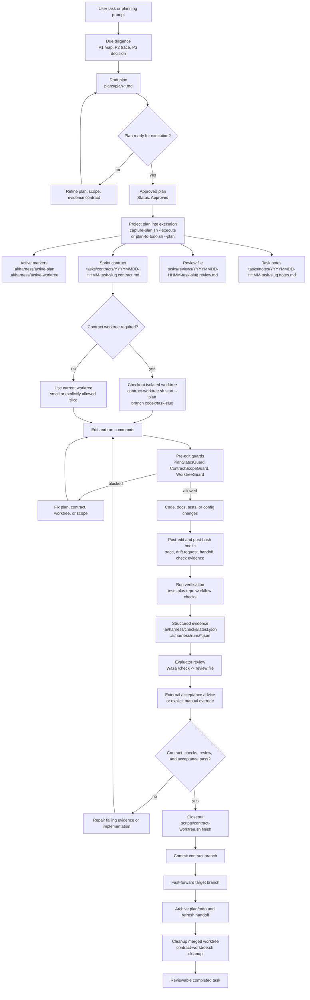
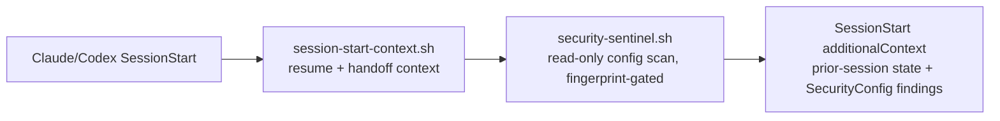
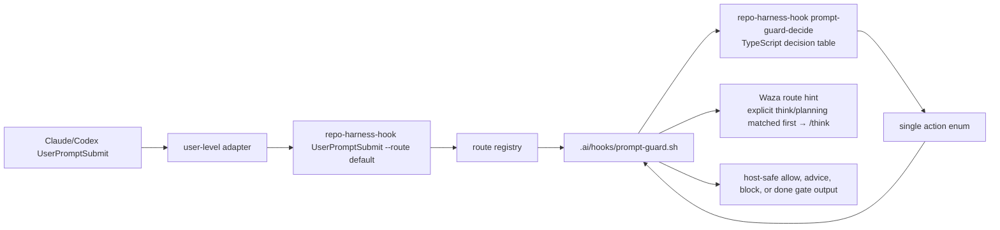

# repo-harness

<p align="center">
  
</p>

Repo-local agentic development harness CLI and skill runtime for Claude/Codex
workflows. The npm package and primary command are now `repo-harness`.
`repo-harness-skill` remains a compatibility alias, while `project-initializer`
install paths are retired and removed by installed-copy sync.
Repository: `https://github.com/Ancienttwo/repo-harness`

[English](README.md) | [简体中文](README.zh-CN.md) | [日本語](README.ja.md) | [Français](README.fr.md) | [Español](README.es.md)

This repository now dogfoods its own tasks-first contract. It is both:

- the source repo for the `repo-harness` CLI and `repo-harness` skill runtime
- a self-hosted example of the repo-local workflow it generates for other projects

## Why repo-harness

- **File-backed sessions, not chat memory.** Separate agent sessions — Claude and
  Codex, now and later — stay coordinated through the repo, not a thread.
  `.ai/hooks/session-start-context.sh` injects the prior session's resume packet
  (`.ai/harness/handoff/resume.md`, `tasks/current.md`) when a new session starts;
  `finalize-handoff.sh` and `post-edit-guard.sh` write the next handoff back on stop
  and after edits. A session can end mid-task and the next one resumes the exact next
  step, blockers, and changed files without re-deriving them.
- **Token-lean by design.** Instead of grep-and-read loops that re-scan the repo every
  session, the harness leans on a pre-built CodeGraph index for structural queries
  (callers, callees, definitions) and on progressive context loading via
  `.ai/context/context-map.json` and `capabilities.json`: a small, stable root context
  (~12KB) plus capability blocks loaded only when the files you touch need them. Agents
  read a 1KB capability contract or query the index instead of spending thousands of
  tokens rediscovering structure.

## What's New in 0.2.3

- **Safer global init defaults.** `repo-harness init` no longer calls the legacy
  Claude plugin setup script or any Superpowers marketplace installer path.
- **Global init command (`repo-harness init`).** One command installs the
  `repo-harness` CLI globally, refreshes repo-harness skill aliases, installs
  user-level Codex/Claude hook adapters, configures Waza
  (`think`, `hunt`, `check`, `health`) plus Mermaid, persists the brain root, and
  configures CodeGraph MCP.
  Run `npx -y repo-harness init`; no source checkout is required.
- **Repo refresh command (`repo-harness update`).** Existing-repo install and
  refresh now has its own command surface, preserving the previous repo-local
  harness migration path while keeping `init` focused on global runtime setup.
- **CodeGraph index self-heal.** When the prompt hook detects structural
  code-navigation intent and the repo has no `.codegraph` index, it initializes
  the index with the local or PATH-visible CodeGraph binary before emitting the
  route hint. This remains advisory: no dependency install, no heavy readiness
  probe, and no prompt block if CodeGraph is unavailable.
- **Security sentinel (`repo-harness security scan` + `security-sentinel.sh`).** A
  read-only check over high-value config injection surfaces (`~/.claude/settings.json`,
  `~/.codex/hooks.json`, repo-local `.vscode/tasks.json`, and legacy project-level
  `.claude`/`.codex` adapters). It flags suspicious command patterns — remote-shell
  pipes, base64-decode-to-exec, `osascript`, `launchctl`/`crontab` persistence, netcat,
  inline interpreter exec — plus unmanaged hooks and auto-run `folderOpen` tasks, and it
  never mutates config. The `SessionStart` sentinel fingerprints the set and re-scans
  only when a fingerprint changes, so there is no session-start noise. Audit on demand:
  `repo-harness security scan --json`.
- **Claude/Codex draft-plan lifecycle.** Plan mode is explicitly two-stage: Draft vs
  Approved. Hooks detect plan-creation intent and track pending orchestration; a stop gate
  (`stop-orchestrator.sh`) requires one self-review pass before a session ends mid-plan.
  Capture a draft with `scripts/capture-plan.sh --slug <slug> --title <title> --status
  Draft`, then promote to Approved and project into execution with `--execute` or
  `scripts/plan-to-todo.sh --plan <plan>`. Plans become the file-backed source of truth in
  `plans/`.

## What repo-harness Does

`repo-harness` turns AI-assisted development from chat-memory coordination into
repo-local workflow state. It installs a small, file-backed contract into a
target repository so Claude, Codex, and humans can agree on:

- what product intent is stable
- which plan is approved for execution
- what the current sprint contract allows
- which checks and review evidence prove the work is done
- how hooks should warn, block, trace, and hand off work across sessions

It is not an agent gateway, product runtime, database service, or MCP server.
The product boundary is deliberately boring: inspect a repo, install or refresh
workflow files, route host events through repo-local hooks, and verify that the
workflow surfaces stay consistent.

## How It Works

The design has three layers:

1. **Source package**: this repository owns the CLI, CLI-backed command facades,
   templates, hook assets, workflow contract, tests, and release gate.
2. **Target repo contract**: `repo-harness update` or migration writes repo-local
   files such as `docs/spec.md`, `plans/`, `tasks/`, `.ai/context/`,
   `.ai/harness/`, helper scripts, and `.ai/hooks/`.
3. **Host adapters**: user-level `~/.claude/settings.json` and
   `~/.codex/hooks.json` route Claude/Codex events into `repo-harness-hook`.
   The hook entrypoint exits silently for non-opt-in repos and dispatches into
   the current repo's `.ai/hooks/*` scripts only when
   `.ai/harness/workflow-contract.json` exists.

For `UserPromptSubmit`, the public adapter contract stays
`repo-harness-hook UserPromptSubmit --route default`. The CLI route registry
dispatches that route to `.ai/hooks/prompt-guard.sh`. The shell hook remains the
repo-local adapter for host JSON parsing, workflow file reads, capture side
effects, quality gate rendering, and host-safe stdout/stderr. The prompt intent
and workflow-state decision is handled by the TypeScript decision engine behind
`repo-harness-hook prompt-guard-decide`, which returns one action enum from an
explicit decision table. That split keeps host configuration stable while moving
the brittle classifier/state-machine layer out of shell conditionals.

The core invariant is that durable truth lives in the repo, not in a chat
thread. Hooks are accelerators and guardrails; the authority remains the
file-backed plan, contract, review, checks, and handoff artifacts.

## Task Workflow: Plan to Closeout

The diagram below assumes the harness is already installed in the repo. It shows
the normal task lifecycle: plan, project into a sprint contract, check out the
contract worktree when policy requires it, implement under hooks, verify, review,
and close out.



## First 5 Minutes

This is the fastest path for an AI tooling owner evaluating whether the workflow is
safe to adopt in a real repo.

### Initial bootstrap

```bash
npx -y repo-harness init
```

`init` is the first-run global bootstrap path. It installs the current npm
package as the global CLI, refreshes repo-harness skill aliases, installs
user-level hook adapters, configures Waza runtime skills, persists a brain root
under `~/.repo-harness/config.json`, and configures CodeGraph MCP. It does not
apply repo-local workflow files to the current directory.

### Install or refresh a repo-local harness

```bash
npx -y repo-harness update --dry-run
npx -y repo-harness update
```

`update` is the existing-repo install and refresh path. Run it from a target
repository to install or refresh workflow files, hook assets, host adapters,
skill aliases, and repo-local verification surfaces from the current npm package.

The npm package release line is now `0.2.x`; generated workflow compatibility is
tracked separately as the `5.x` model line. The `0.2.3` package splits first-run
global bootstrap (`repo-harness init`) from repo-local refresh
(`repo-harness update`), replaces the legacy global plugin installer path with
typed CLI/hook/dependency bootstrap, keeps the read-only config security sentinel
(`repo-harness security scan`), the explicit Claude/Codex draft-plan lifecycle,
and adds non-blocking CodeGraph index initialization for structural prompt
routing.
These sit on top of the renamed `repo-harness` CLI, user-level hook
adapter bootstrap, AI-native scaffold overlays, the typed prompt-guard decision
engine, plan-stem task artifact naming, `REPO_HARNESS_*` runtime aliases, Waza
runtime skill sync, and the maintainer release gate.

Only maintainers editing the package need a source checkout:

```bash
git clone https://github.com/Ancienttwo/repo-harness.git ~/Projects/repo-harness
cd ~/Projects/repo-harness
bun src/cli/index.ts update
```

Local path model:

- Source repo: `~/Projects/repo-harness`
- Claude skill aliases: `~/.claude/skills/repo-harness`, `~/.claude/skills/repo-harness-skill`
- Codex discoverable skill alias: `~/.codex/skills/repo-harness`
- Codex compatibility fallback alias: `~/.codex/skills/repo-harness-skill`

The `~/Projects/repo-harness` repo is the only editable source of truth. Local
Claude/Codex paths are symlink-backed runtime entrypoints. Only
`~/.codex/skills/repo-harness` should expose `SKILL.md` and
`assets/skill-commands/`; compatibility directories exist only so renamed
repos can still resolve upstream assets without duplicate command discovery.
The retired `project-initializer` directories under `~/.codex/skills` and
`~/.claude/skills` are deleted by `scripts/sync-codex-installed-copies.sh`.

### Minimum prerequisites

- Git working tree
- `bash`
- `bun` for follow-up verification and template assembly
- `jq` is optional for `--dry-run`, but recommended when applying settings merges

### Start here

For an existing repo, run from the repo root:

```bash
npx -y repo-harness update --dry-run
```

Apply only after the dry-run report looks correct:

```bash
npx -y repo-harness update
```

For a new project or module, use the branch command `repo-harness-scaffold`. For
an existing repo, use `repo-harness update`; it installs or refreshes the harness
without creating an application stack.

### Success looks like this

The command should end with `=== Migration Report ===` and summarize:

- `Project hooks synced from:` to show where generated hook behavior comes from
- `Host hook config target: user-level ~/.claude/settings.json and ~/.codex/hooks.json` to show the adapter layer
- `Host hook adapters are user-level:` to remind the user to install global adapters and trust `~/.codex/hooks.json`
- `Workflow migration:` to show the repo-local harness surfaces it will create or refresh
- `Helper scripts:` to show the operational toolchain you get after apply
- `--- External Tooling ---` to show default gstack/Waza/gbrain routing plus advisory install/update hints

### Next two commands

```bash
bash scripts/check-task-workflow.sh --strict
bun test
```

If the dry-run output looks wrong, stop there and inspect
[`docs/reference-configs/hook-operations.md`](docs/reference-configs/hook-operations.md)
before applying anything.

## Hook Authority Map

- `.ai/hooks/` is the only shared hook implementation you should edit first.
- `~/.claude/settings.json` is the user-level Claude adapter that dispatches into opted-in repos.
- `~/.codex/hooks.json` is the user-level Codex adapter that dispatches into the same runner.
- Repo-local `.claude/settings.json` and `.codex/hooks.json` hook adapters are legacy project-level config and should be retired during migration.
- Codex must mark `~/.codex/hooks.json` as trusted in Codex Settings before those hooks run.
- Debug in this order: user-level adapter config -> `repo-harness-hook` (or fallback `repo-harness hook`) -> route registry -> `.ai/hooks/*`.

`SessionStart` runs two ordered scripts before work begins:



Prompt guard has one extra internal step:



The shell layer still owns filesystem authority and side effects. TypeScript owns
only the classifier plus `intent x plan state` decision table.

## Hook Failure Playbook

When a hook blocks work, start with the structured output in the terminal. The core
fields are `guard`, `reason`, `fix`, `failure_class`, and `run_id`.

- Failure log: `.ai/harness/failures/latest.jsonl`
- Trace log: `.claude/.trace.jsonl`
- Deep guide: [`docs/reference-configs/hook-operations.md`](docs/reference-configs/hook-operations.md)

Most common guards:

- `PlanStatusGuard`: no active plan, or the plan is not ready to execute
- `ContractGuard`: approved execution has not yet produced the contract/review/notes scaffold
- `ContractGuard`: completion was claimed before the task contract passed
- `WorktreeGuard`: writes were attempted in the primary worktree while linked worktrees are enforced

## Repo Workflow

- Root routing docs: `CLAUDE.md`, `AGENTS.md`
- Shared hook layer: `.ai/hooks/`
- User-level adapter layer: `~/.claude/settings.json`, `~/.codex/hooks.json`
- Active execution surface: `tasks/`
- Plan source of truth: `plans/`
- Durable progress: `tasks/workstreams/`
- Release history: `docs/CHANGELOG.md`

## Current Release

- npm package: `repo-harness@0.2.3`
- Generated workflow compatibility: `5.2.3`
- GitHub repository: `Ancienttwo/repo-harness`
- Release history: [`docs/CHANGELOG.md`](docs/CHANGELOG.md)

## Current Model (5.2.3)

- Question flow uses **12 grouped decision points** with harness defaults inferred first.
- Plan menu is tiered:
  - **Core Plans (A-F)** first.
  - **Custom Presets (G-K)** only when needed.
- Skill routing is inspection-first:
  - `scripts/inspect-project-state.ts`
  - `scripts/migrate-workflow-docs.ts`
  - `assets/workflow-contract.v1.json`
- Runtime mode is configurable with template vars:
  - `{{RUNTIME_MODE}}`
  - `{{RUNTIME_PROFILE}}`
  - `{{RECOVERY_PROFILE}}`
  - `{{STATE_PROFILE}}`
- Question-pack source of truth is in:
  - `assets/initializer-question-pack.v4.json`
- Generated repos default to the repo-local harness flow:
  - `docs/spec.md -> plans/ -> tasks/contracts/ -> tasks/reviews/ -> .ai/context/context-map.json -> .ai/harness/*`
- Generated and self-hosted repos install:
  - `.ai/harness/workflow-contract.json`
  - `.ai/harness/policy.json`
- Generated and migrated repos default `external_tooling` to:
  - `complex -> gstack`
  - `simple -> Waza` with Codex-first runtime copies in `~/.codex/skills`
  - `knowledge -> gbrain`
- `repo-harness init` bootstraps the Codex/Claude runtime pieces needed for the
  default workflow:
  - refreshes `repo-harness` skill aliases
  - installs global Codex/Claude hook adapters
  - installs Waza skills (`think`, `hunt`, `check`, `health`) and Mermaid through the skills CLI
  - persists the brain root in `~/.repo-harness/config.json`
  - configures CodeGraph MCP for selected host agents
- Other external tooling stays advisory-only:
  - `bash scripts/check-agent-tooling.sh --host both --check-updates`
  - Waza update checks compare upstream `tw93/Waza` `SKILL.md` hashes without running `npx skills check`
  - no automatic gstack, gbrain MCP, CodeGraph daemon, or provider setup
- Manual distillation stays repo-local:
  - repeated corrections -> `tasks/lessons.md`
  - deep findings and hidden contracts -> `tasks/research.md`
  - sprint verification evidence -> `tasks/reviews/*.review.md`
  - durable capability progress -> `tasks/workstreams/`
  - release history -> `docs/CHANGELOG.md`

## Acknowledgements and Tooling Dependencies

`repo-harness` is built around a small set of external skills and repos that
proved useful while this project was being designed, debugged, and released.
They are acknowledged here because they shaped the workflow contract, but they
are not all bundled product dependencies.

| Tool or repo | Used for | Dependency shape |
| --- | --- | --- |
| gstack skills, including `document-release`, `office-hours`, `plan-eng-review`, and `plan-design-review` | Product discovery, plan review, design review, and post-ship documentation hygiene | External operator workflow; advisory by default |
| Waza core skills `think`, `hunt`, `check`, and `health` | Daily planning, bug hunts, verification, health checks, and Codex-first skill sync | Installed through the skills CLI into host skill roots |
| `mermaid` | Human-readable architecture and system-flow diagrams when Mermaid is not enough | Runtime-referenced skill, not vendored into generated repos |
| `gbrain` | Knowledge sync, handoff retrieval, and long-form repo memory | Optional external CLI and index |
| CodeGraph (`@colbymchenry/codegraph`) | Symbol-aware navigation, impact tracing, and readiness checks for this self-host repo | Dev dependency in this repo; generated repos stay global-MCP-first unless policy opts in |
| Bun | Source checkout execution, tests, template assembly, and release checks | Required local runtime for maintainers |
| `commander` | `repo-harness` CLI command parsing | Runtime npm dependency |

## Action Command Skills

Source-owned command facades live in `assets/skill-commands/`. They keep host
skill discovery compatible while the CLI and hooks own execution:

- Planning and review: `repo-harness-plan`, `repo-harness-review`, `repo-harness-autoplan`
- Repo workflow actions: `repo-harness-ship`, `repo-harness-init`, `repo-harness-migrate`, `repo-harness-upgrade`, `repo-harness-capability`, `repo-harness-architecture`, `repo-harness-handoff`, `repo-harness-deploy`, `repo-harness-repair`, `repo-harness-check`
- Branch project creation command: `repo-harness-scaffold`

`repo-harness update` is for an existing repo; `repo-harness-scaffold` creates a
new project or module scaffold as a side command. `hooks-init`, `docs-init`, and
`create-project-dirs` are internal steps, not public commands.

`repo-harness-scaffold` keeps the A-K plan catalog as the project-type authority
and adds AI-native app structure through an optional `ai_native_profile` overlay.
The default profile is `none`, so existing scaffold output remains unchanged.
When selected, profiles such as `runtime-console`, `product-copilot`, and
`sidecar-kernel` document the AG-UI event boundary, assistant-ui or CopilotKit
UI runtime, Bun/Hono gateway, shared contracts, observability, and MCP/HTTP
sidecar rules without installing model providers or making Python, Go, Rust, or
A2UI mandatory defaults.

Use `repo-harness-capability` when the harness already exists and only selected
capability boundaries should be added. It updates `.ai/context/capabilities.json`,
syncs the requested local `AGENTS.md` / `CLAUDE.md` contract files, and validates
the registry without running a full init, migrate, or upgrade pass.

Use `repo-harness-architecture`, `repo-harness-handoff`, and `repo-harness-deploy`
for focused architecture documentation, rollover, and deploy/ops readiness
passes. These commands call existing repo-local helpers and keep their scope
narrow instead of refreshing the full harness.

Codex installed-copy rule: only `~/.codex/skills/repo-harness` exposes the root
skill and `repo-harness-*` command facades. The compatibility directory
`~/.codex/skills/repo-harness-skill` is a runtime fallback bundle only; it must
not contain `SKILL.md` files or `assets/skill-commands/`. The retired
`~/.codex/skills/project-initializer` and `~/.claude/skills/project-initializer`
directories are removed during sync.

After cloning or moving this source repo, rebuild the local runtime aliases with:

```bash
bash scripts/sync-codex-installed-copies.sh
```

By default, the script keeps local Claude/Codex runtime paths linked back to the
source repo. Set `AGENTIC_DEV_LINK_INSTALLED_COPIES=0` for copy-based staging,
and set `CODEX_SKILLS_ROOT` or `CLAUDE_SKILLS_ROOT` to stage under alternate
runtime roots.

## Maintainer Reference

### Self-check this repository's workflow contract

```bash
bash scripts/check-task-sync.sh
bash scripts/check-task-workflow.sh --strict
bun scripts/inspect-project-state.ts --repo . --format text
bash scripts/migrate-project-template.sh --repo . --dry-run
```

### Explicit template assembly

```bash
bun scripts/assemble-template.ts --plan C --name "MyProject"
bun scripts/assemble-template.ts --target agents --plan C --name "MyProject"
```

### Local benchmark skeleton

```bash
bun run benchmark:skills --dry-run
```

### Run one eval across both Claude and Codex

```bash
bun run benchmark:skills --eval repair-agents-task-sync
```

## Key Files

- Skill spec: `SKILL.md`
- Root routing docs: `CLAUDE.md`, `AGENTS.md`
- Plan mapping: `assets/plan-map.json`
- Question-pack: `assets/initializer-question-pack.v4.json`
- Shared hooks: `assets/hooks/`
- Workflow contract: `assets/workflow-contract.v1.json`
- Hook operations reference: `docs/reference-configs/hook-operations.md`
- Template assembler: `scripts/assemble-template.ts`
- Question inference helper: `scripts/initializer-question-pack.ts`
- State inspector: `scripts/inspect-project-state.ts`
- Legacy-doc migrator: `scripts/migrate-workflow-docs.ts`
- External tooling detector: `scripts/check-agent-tooling.sh`
- Scaffolding scripts:
  - `scripts/init-project.sh`
  - `scripts/create-project-dirs.sh`

## Generated vs Self-Hosted Hook Parity

- Downstream hook behavior is defined by generated output from `assets/hooks/` plus
  `assets/reference-configs/`.
- This repo dogfoods the same contract, but self-host behavior is not magically in
  sync with generated repos unless a change explicitly updates both surfaces.
- Every hook change should say whether it affects `self-host`, `generated`, or `both`.

## Package Manager Defaults

- General default priority: `bun > pnpm > npm`
- **Plan G/H** (Python-centric) default to **`uv`** as primary package manager.

## Runtime Profiles

- `Plan-only (recommended)` (default)
- `Plan + Permissionless`
- `Standard (ask before each action)`

Configured in `assets/initializer-question-pack.v4.json` and consumed by `scripts/initializer-question-pack.ts`.

## Verification

```bash
bun test
bash scripts/check-task-sync.sh
bash scripts/check-task-workflow.sh --strict
bun scripts/inspect-project-state.ts --repo . --format text
bash scripts/migrate-project-template.sh --repo . --dry-run
bash scripts/check-agent-tooling.sh --host both --check-updates
bun run benchmark:skills --dry-run
```
