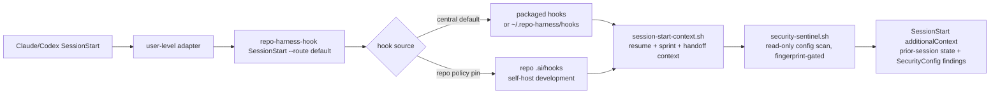
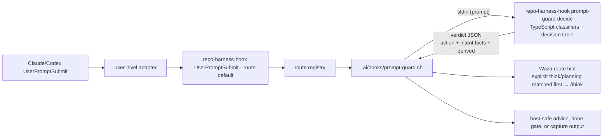

# repo-harness

<p align="center">
  
</p>

Repo-local agentic development harness CLI and skill runtime for Claude/Codex
workflows. The npm package and primary command are now `repo-harness`.
The legacy `repo-harness-skill` and `project-initializer` install paths are
retired and removed by installed-copy sync.
Repository: `https://github.com/Ancienttwo/repo-harness`

[English](README.md) | [简体中文](README.zh-CN.md) | [日本語](README.ja.md) | [Français](README.fr.md) | [Español](README.es.md)

This repository now dogfoods its own tasks-first contract. It is both:

- the source repo for the `repo-harness` CLI and `repo-harness` skill runtime
- a self-hosted example of the repo-local workflow it generates for other projects

## Why repo-harness

- **File-backed sessions, not chat memory.** Separate agent sessions — Claude and
  Codex, now and later — stay coordinated through the repo, not a thread.
  `.ai/hooks/session-start-context.sh` injects the prior session's resume packet
  (`.ai/harness/handoff/resume.md`, `tasks/current.md`) when a new session starts;
  `finalize-handoff.sh` and `post-edit-guard.sh` write the next handoff back on stop
  and after edits. A session can end mid-task and the next one resumes the exact next
  step, blockers, and changed files without re-deriving them.
- **Token-lean by design.** Instead of grep-and-read loops that re-scan the repo every
  session, the harness leans on a pre-built CodeGraph index for structural queries
  (callers, callees, definitions) and on progressive context loading via
  `.ai/context/context-map.json` and `capabilities.json`: a small, stable root context
  (~12KB) plus capability blocks loaded only when the files you touch need them. Agents
  read a 1KB capability contract or query the index instead of spending thousands of
  tokens rediscovering structure.

## What's New in 0.4.1

- **Session-scoped CodeGraph nudges.** Hook stdin `session_id` now drives the
  one-shot CodeGraph route hint, so stale local session files no longer suppress
  or repeat guidance across independent Claude/Codex sessions.
- **Central-first hook safety.** Generated and migrated repos stay on the
  user-level hook runtime by default; repo-local top-level hook scripts are
  pruned unless `.ai/harness/policy.json` explicitly pins `"hook_source": "repo"`.
- **Workflow document migration.** Active workflow docs now use
  `tasks/todos.md` for deferred goals and `docs/researches/*.md` for durable
  research, with legacy `tasks/todo.md` and `tasks/research.md` treated as
  migration inputs.
- **Release-gate stability.** Runtime ignore rules cover transient
  `tasks/.current.md.tmp.*` and `.claude/.plan-state/` state, and the default
  Bun test timeout matches the release gate budget.

## What repo-harness Does

`repo-harness` turns AI-assisted development from chat-memory coordination into
repo-local workflow state. It installs a small, file-backed contract into a
target repository so Claude, Codex, and humans can agree on:

- what product intent is stable
- which plan is approved for execution
- what the current sprint contract allows
- which checks and review evidence prove the work is done
- how hooks should warn, block, trace, and hand off work across sessions

It is not an agent gateway, product runtime, database service, or MCP server.
The product boundary is deliberately boring: inspect a repo, install or refresh
workflow files, route host events through repo-local hooks, and verify that the
workflow surfaces stay consistent.

## How It Works

The design has three layers:

1. **Source package**: this repository owns the CLI, CLI-backed command facades,
   templates, hook assets, workflow contract, tests, and release gate.
2. **Target repo contract**: `repo-harness update` or migration writes repo-local
   files such as `docs/spec.md`, `plans/`, `tasks/`, `.ai/context/`,
   `.ai/harness/`, helper scripts, and `.ai/hooks/`.
3. **Host adapters**: user-level `~/.claude/settings.json` and
   `~/.codex/hooks.json` route Claude/Codex events into `repo-harness-hook`.
   The hook entrypoint exits silently for non-opt-in repos. For opted-in repos,
   it resolves hooks central-first through the packaged install or
   `~/.repo-harness/hooks/`, with repo policy able to pin self-host development
   back to `.ai/hooks/*`.

For `UserPromptSubmit`, the public adapter contract stays
`repo-harness-hook UserPromptSubmit --route default`. The CLI route registry
dispatches that route to `.ai/hooks/prompt-guard.sh`. The shell hook remains the
repo-local adapter for host JSON parsing, workflow file reads, capture side
effects, and host-safe stdout/stderr. It pipes the prompt text into
`repo-harness-hook prompt-guard-decide`, where every prompt-text intent
classifier (Unicode-aware, `src/cli/hook/prompt-intents.ts`) and the
`intent x plan state` decision table live; the engine returns one verdict JSON
line with the action, the classified intent facts, and derived strings. The
shell keeps no duplicate classifier or fallback decision table — when the
engine is unreachable the prompt layer degrades to a one-shot advisory.

Prompt-layer plan/spec/contract gates are advisory routing. Hard enforcement
lives at the edit boundary: `pre-edit-guard.sh` blocks implementation edits
unless the active plan is Approved/Executing (policy
`.guards.edit_plan_gate`: enforce | advice | off). Done-claim gates keep
blocking because they verify file-backed completion evidence, not language.

The core invariant is that durable truth lives in the repo, not in a chat
thread. Hooks are accelerators and guardrails; the authority remains the
file-backed plan, contract, review, checks, and handoff artifacts.

## Task Workflow: Plan to Closeout

The diagram below assumes the harness is already installed in the repo. It shows
the normal lifecycle from a program sprint backlog down to one contract task:
draft or select the task, project it into execution files, check out the
contract worktree when policy requires it, implement under hooks, verify, review,
complete the sprint task when applicable, and close out. The 0.4.x loop-system
surfaces add scheduled heartbeat discovery, state-snapshot/eval evidence for
routing changes, architecture queue freshness, and optional contract-run
delegation without changing the file-backed authority model.

```mermaid
flowchart TD
  Program["Program goal or release theme"] --> Sprint{"Sprint layer needed?"}
  Sprint -->|yes| PRD["Upper-layer PRD<br/>plans/prds/*.prd.md"]
  PRD --> SprintDoc["Sprint backlog<br/>plans/sprints/*.sprint.md"]
  SprintDoc --> NextTask["Select next sprint task<br/>sprint-backlog.sh next"]
  Sprint -->|no| UserTask["User task or planning prompt"]
  Heartbeat["Heartbeat triage<br/>scripts/heartbeat-triage.sh<br/>.ai/harness/triage/"] --> UserTask
  NextTask --> UserTask

  UserTask --> Discovery["Due diligence<br/>P1 map, P2 trace, P3 decision"]
  Discovery --> LoopEvidence["Loop evidence when routing changes<br/>state-snapshot --json<br/>route-nl-vs-ts / cutover gate"]
  LoopEvidence --> PlanDraft["Draft plan<br/>plans/plan-*.md"]
  PlanDraft --> PlanReview{"Plan ready for execution?"}
  PlanReview -->|no| Refine["Refine plan, scope, evidence contract"]
  Refine --> PlanDraft
  PlanReview -->|yes| Approve["Approved plan<br/>Status: Approved"]

  Approve --> Project["Project plan into execution<br/>capture-plan.sh --execute<br/>or plan-to-todo.sh --plan"]
  Project --> Active["Active markers<br/>.ai/harness/active-plan<br/>.ai/harness/active-worktree"]
  Project --> SprintActive["Sprint projection<br/>active-sprint marker<br/>tasks/current.md"]
  Project --> Contract["Sprint contract<br/>tasks/contracts/YYYYMMDD-HHMM-task-slug.contract.md"]
  Project --> ReviewFile["Review file<br/>tasks/reviews/YYYYMMDD-HHMM-task-slug.review.md"]
  Project --> Notes["Task notes<br/>tasks/notes/YYYYMMDD-HHMM-task-slug.notes.md"]

  Contract --> Delegation["Delegation contract<br/>budget / permission_scope / roles"]
  Delegation --> Delegate{"Use contract-run delegation?"}
  Delegate -->|yes| ContractRun["Worker/verifier child run<br/>scripts/contract-run.ts"]
  Delegate -->|no| WorktreePolicy{"Contract worktree required?"}
  WorktreePolicy -->|yes| Checkout["Checkout isolated worktree<br/>contract-worktree.sh start --plan<br/>branch codex/task-slug"]
  WorktreePolicy -->|no| CurrentTree["Use current worktree<br/>small or explicitly allowed slice"]
  Checkout --> Implement
  CurrentTree --> Implement
  ContractRun --> Changes

  Implement["Edit and run commands"] --> PreHooks["Pre-edit guards<br/>PlanStatusGuard, ContractScopeGuard, WorktreeGuard"]
  PreHooks -->|blocked| ScopeFix["Fix plan, contract, worktree, or scope"]
  ScopeFix --> Implement
  PreHooks -->|allowed| Changes["Code, docs, tests, or config changes"]
  Changes --> PostHooks["Post-edit and post-bash hooks<br/>trace, drift request, handoff, check evidence"]
  PostHooks --> ArchQueue["Architecture queue<br/>architecture-queue.sh record/reindex<br/>check-architecture-sync.sh"]
  ArchQueue --> Verify["Run verification<br/>tests plus repo workflow checks"]

  Verify --> Checks["Structured evidence<br/>.ai/harness/checks/latest.json<br/>.ai/harness/runs/*.json"]
  Checks --> CheckReview["Evaluator review<br/>Waza /check -> review file"]
  CheckReview --> External["External acceptance advice<br/>or explicit manual override"]
  External --> DoneGate{"Contract, checks, review, and acceptance pass?"}
  DoneGate -->|no| Repair["Repair failing evidence or implementation"]
  Repair --> Implement
  DoneGate -->|yes| SprintComplete{"Sprint task active?"}
  SprintComplete -->|yes| MarkSprint["Mark backlog item complete<br/>sprint-backlog.sh complete-task"]
  SprintComplete -->|no| Closeout["Closeout<br/>scripts/contract-worktree.sh finish"]
  MarkSprint --> Closeout

  Closeout --> Commit["Commit contract branch"]
  Commit --> Merge["Fast-forward target branch"]
  Merge --> Archive["Archive plan/todo and refresh handoff"]
  Archive --> Cleanup["Cleanup merged worktree<br/>contract-worktree.sh cleanup"]
  Cleanup --> Done["Reviewable completed task"]
```



## Long-Running Product Loops

For Greenfield and Brownfield work, front-load discovery and engineering-plan
judgment in Claude-Fable before asking Codex to loop on execution:

1. In Claude-Fable, use gstack `office-hours` for product discovery or
   `plan-eng-review` for engineering plan review. The output should be the
   development documents that lock product intent, architecture, risks, and the
   evidence contract.
2. Turn those documents into an upper-layer PRD under `plans/prds/`, then into
   an ordered sprint backlog under `plans/sprints/` with detailed sub-plans for
   each execution slice.
3. In Codex, create a Goal that points at that sprint file. The harness can then
   project each sprint item through the normal plan -> contract -> worktree ->
   verification flow.

That handoff keeps long-running loops precise: Claude-Fable owns the broad
front-loaded judgment, the PRD remains the upper source of truth, the sprint
backlog is the durable execution queue, and Codex Goal mode resumes against a
concrete sprint instead of reinterpreting the original chat.

## First 5 Minutes

This is the fastest path for an AI tooling owner evaluating whether the workflow is
safe to adopt in a real repo.

### Initial bootstrap

```bash
npx -y repo-harness init
```

`init` is the first-run global bootstrap path. It installs the current npm
package as the global CLI, refreshes repo-harness skill aliases, installs
user-level hook adapters, configures Waza runtime skills, persists a brain root
under `~/.repo-harness/config.json`, and configures CodeGraph MCP. It does not
apply repo-local workflow files to the current directory.

### Install or refresh a repo-local harness

```bash
npx -y repo-harness update --dry-run
npx -y repo-harness update
```

`update` is the existing-repo install and refresh path. Run it from a target
repository to install or refresh workflow files, hook assets, host adapters,
skill aliases, and repo-local verification surfaces from the current npm package.

The npm package and generated workflow stamp now share the `0.4.x` release line.
The `0.4.1` package keeps first-run
global bootstrap (`repo-harness init`) separate from repo-local refresh
(`repo-harness update`) while hardening session-scoped hook state, central-first
hook execution, workflow-document migration, and release-gate stability on top
of the `0.4.0` loop-engine surfaces.
These sit on top of the renamed `repo-harness` CLI, user-level hook
adapter bootstrap, AI-native scaffold overlays, the typed prompt-guard decision
engine, plan-stem task artifact naming, `REPO_HARNESS_*` runtime aliases, Waza
runtime skill sync, and the maintainer release gate.

Only maintainers editing the package need a source checkout:

```bash
git clone https://github.com/Ancienttwo/repo-harness.git ~/Projects/repo-harness
cd ~/Projects/repo-harness
bun src/cli/index.ts update
```

Local path model:

- Source repo: `~/Projects/repo-harness`
- Claude skill alias: `~/.claude/skills/repo-harness`
- Codex discoverable skill alias: `~/.codex/skills/repo-harness`

The `~/Projects/repo-harness` repo is the only editable source of truth. Local
Claude/Codex paths are symlink-backed runtime entrypoints. Only
`~/.codex/skills/repo-harness` should expose `SKILL.md` and
`assets/skill-commands/`. The retired `repo-harness-skill` and
`project-initializer` directories under `~/.codex/skills` and
`~/.claude/skills` are deleted by `scripts/sync-codex-installed-copies.sh`.

### Minimum prerequisites

- Git working tree
- `bash`
- `bun` for follow-up verification and template assembly
- `jq` is optional for `--dry-run`, but recommended when applying settings merges

### Start here

For an existing repo, run from the repo root:

```bash
npx -y repo-harness update --dry-run
```

Apply only after the dry-run report looks correct:

```bash
npx -y repo-harness update
```

For a new project or module, use the branch command `repo-harness-scaffold`. For
an existing repo, use `repo-harness update`; it installs or refreshes the harness
without creating an application stack.

### Success looks like this

The command should end with `=== Migration Report ===` and summarize:

- `Project hooks synced from:` to show where generated hook behavior comes from
- `Host hook config target: user-level ~/.claude/settings.json and ~/.codex/hooks.json` to show the adapter layer
- `Host hook adapters are user-level:` to remind the user to install global adapters and trust `~/.codex/hooks.json`
- `Workflow migration:` to show the repo-local harness surfaces it will create or refresh
- `Helper runtime:` to show `.ai/harness/scripts/*` implementations and `scripts/*` compatibility wrappers after apply
- `--- External Tooling ---` to show default gstack/Waza/gbrain routing plus advisory install/update hints

### Next two commands

```bash
bash scripts/check-task-workflow.sh --strict
bun test
```

If the dry-run output looks wrong, stop there and inspect
[`docs/reference-configs/hook-operations.md`](docs/reference-configs/hook-operations.md)
before applying anything.

## Hook Authority Map

- `.ai/hooks/` is the only shared hook implementation you should edit first.
- `~/.claude/settings.json` is the user-level Claude adapter that dispatches into opted-in repos.
- `~/.codex/hooks.json` is the user-level Codex adapter that dispatches into the same runner.
- Repo-local `.claude/settings.json` and `.codex/hooks.json` hook adapters are legacy project-level config and should be retired during migration.
- Codex must mark `~/.codex/hooks.json` as trusted in Codex Settings before those hooks run.
- Debug in this order: user-level adapter config -> `repo-harness-hook` (or fallback `repo-harness hook`) -> route registry -> `.ai/hooks/*`.
- If `repo-harness-hook` reports `.ai/hooks` drift, refresh the repo-local copy with `repo-harness update --repo <root>`.

`SessionStart` resolves hooks central-first, then runs two ordered scripts before
work begins:



`SessionStart` and `Stop` hooks are advisory for missing repo-local scripts: stale
repos get a drift warning instead of a startup failure. Required guard routes,
including edit and prompt gates, still fail closed when their scripts are
missing.

Prompt guard has one extra internal step:



The shell layer owns filesystem authority and side effects. TypeScript owns all
prompt-text classification plus the `intent x plan state` decision table.
Plan-state blocks render at the PreToolUse edit layer, not here.

## Hook Failure Playbook

When a hook blocks work, start with the structured output in the terminal. The core
fields are `guard`, `reason`, `fix`, `failure_class`, and `run_id`.

- Failure log: `.ai/harness/failures/latest.jsonl`
- Trace log: `.claude/.trace.jsonl`
- Deep guide: [`docs/reference-configs/hook-operations.md`](docs/reference-configs/hook-operations.md)

Most common guards:

- `PlanStatusGuard` (edit layer): an implementation edit was attempted with no active plan, or the plan is not ready to execute; the prompt layer emits the same guard name as advisory guidance
- `ContractGuard`: approved execution has not yet produced the contract/review/notes scaffold
- `ContractGuard`: completion was claimed before the task contract passed
- `WorktreeGuard`: writes were attempted in the primary worktree while linked worktrees are enforced

## Repo Workflow

- Root routing docs: `CLAUDE.md`, `AGENTS.md`
- Shared hook layer: `.ai/hooks/`
- User-level adapter layer: `~/.claude/settings.json`, `~/.codex/hooks.json`
- Active execution surface: `tasks/`
- Plan source of truth: `plans/`
- Durable progress: `tasks/workstreams/`
- Release history: `docs/CHANGELOG.md`

## Current Release

- npm package: `repo-harness@0.4.1`
- Generated workflow stamp: `repo-harness@0.4.1+template@0.4.1`
- GitHub repository: `Ancienttwo/repo-harness`
- Release history: [`docs/CHANGELOG.md`](docs/CHANGELOG.md)

## Current Model

- Question flow uses **12 grouped decision points** with harness defaults inferred first.
- Plan menu is tiered:
  - **Core Plans (A-F)** first.
  - **Custom Presets (G-K)** only when needed.
- Skill routing is inspection-first:
  - `scripts/inspect-project-state.ts`
  - `scripts/migrate-workflow-docs.ts`
  - `assets/workflow-contract.v1.json`
- Runtime mode is configurable with template vars:
  - `{{RUNTIME_MODE}}`
  - `{{RUNTIME_PROFILE}}`
  - `{{RECOVERY_PROFILE}}`
  - `{{STATE_PROFILE}}`
- Question-pack source of truth is in:
  - `assets/initializer-question-pack.v4.json`
- Generated repos default to the repo-local harness flow:
  - `docs/spec.md -> plans/ -> tasks/contracts/ -> tasks/reviews/ -> .ai/context/context-map.json -> .ai/harness/*`
- Generated and self-hosted repos install:
  - `.ai/harness/workflow-contract.json`
  - `.ai/harness/policy.json`
- Generated and migrated repos default `external_tooling` to:
  - `complex -> gstack`
  - `simple -> Waza` with Codex-first runtime copies in `~/.codex/skills`
  - `knowledge -> gbrain`
- `repo-harness init` bootstraps the Codex/Claude runtime pieces needed for the
  default workflow:
  - refreshes `repo-harness` skill aliases
  - installs global Codex/Claude hook adapters
  - installs Waza skills (`think`, `hunt`, `check`, `health`) and Mermaid through the skills CLI
  - persists the brain root in `~/.repo-harness/config.json`
  - configures CodeGraph MCP for selected host agents
- Other external tooling stays advisory-only:
  - `bash scripts/check-agent-tooling.sh --host both --check-updates`
  - Waza update checks compare upstream `tw93/Waza` `SKILL.md` hashes without running `npx skills check`
  - no automatic gstack, gbrain MCP, CodeGraph daemon, or provider setup
- Manual distillation stays repo-local:
  - repeated corrections -> `tasks/lessons.md`
  - deep findings and hidden contracts -> topic-scoped `docs/researches/*.md`
  - sprint verification evidence -> `tasks/reviews/*.review.md`
  - durable capability progress -> `tasks/workstreams/`
  - release history -> `docs/CHANGELOG.md`

## Acknowledgements and Workflow Influences

`repo-harness` is built around a small set of external skills, repos, and agent
runtimes that
proved useful while this project was being designed, debugged, and released.
They are acknowledged here because they shaped the workflow contract, but they
are not ordinary bundled product dependencies.

| Tool or repo | Used for | Dependency shape |
| --- | --- | --- |
| [Hylarucoder](https://x.com/hylarucoder) / Geju | P1/P2/P3 due-diligence method and Geju practice that shaped the planning, tracing, and decision-rationale discipline in this workflow | Methodology contribution and acknowledgement; not a bundled dependency |
| Waza by [TW93](https://x.com/HiTw93), including `think`, `hunt`, `check`, and `health` | Daily planning, bug hunts, verification, health checks, and Codex-first skill sync | Installed through the skills CLI into host skill roots |
| gstack skills and `gbrain` by [Garry Tan](https://x.com/garrytan) | Product discovery, plan review, design review, post-ship documentation hygiene, knowledge sync, handoff retrieval, and long-form repo memory | External operator workflow plus optional external CLI/index; advisory by default |
| `mermaid` | Human-readable architecture and system-flow diagrams when Mermaid is not enough | Runtime-referenced skill, not vendored into generated repos |
| CodeGraph (`@colbymchenry/codegraph`) | Symbol-aware navigation, impact tracing, and readiness checks for this self-host repo | Dev dependency in this repo; generated repos stay global-MCP-first unless policy opts in |
| OpenAI Codex | Primary execution agent for repo-local implementation, verification, and GitHub contributor attribution when a commit materially includes Codex-authored work | External agent runtime; attribution is an explicit commit trailer, not hidden hook automation |

### GitHub Contributor Attribution

When Codex materially contributes to a commit, use GitHub's standard co-author
trailer format at the end of the commit message:

```text
Co-authored-by: codex <codex@openai.com>
```

Keep this opt-in and visible per commit. Do not bake it into downstream
repo-harness commit scripts or hooks unless that repo explicitly adopts the same
policy.

## Action Command Skills

Source-owned command facades live in `assets/skill-commands/`. They keep host
skill discovery compatible while the CLI and hooks own execution:

- Planning and review: `repo-harness-plan`, `repo-harness-review`, `repo-harness-autoplan`
- Product planning layer: `repo-harness-prd` (upper-layer PRDs in `plans/prds/`, evidence-marked unknowns, sprint-consumable sections)
- Sprint program layer: `repo-harness-sprint` (ordered sprint backlogs in `plans/sprints/`, each row expanded with `$think` before the contract flow)
- Repo workflow actions: `repo-harness-ship`, `repo-harness-init`, `repo-harness-migrate`, `repo-harness-upgrade`, `repo-harness-capability`, `repo-harness-architecture`, `repo-harness-handoff`, `repo-harness-deploy`, `repo-harness-repair`, `repo-harness-check`
- Branch project creation command: `repo-harness-scaffold`

`repo-harness update` is for an existing repo; `repo-harness-scaffold` creates a
new project or module scaffold as a side command. `hooks-init`, `docs-init`, and
`create-project-dirs` are internal steps, not public commands.

`repo-harness-scaffold` keeps the A-K plan catalog as the project-type authority
and adds AI-native app structure through an optional `ai_native_profile` overlay.
The default profile is `none`, so existing scaffold output remains unchanged.
When selected, profiles such as `runtime-console`, `product-copilot`, and
`sidecar-kernel` document the AG-UI event boundary, assistant-ui or CopilotKit
UI runtime, Bun/Hono gateway, shared contracts, observability, and MCP/HTTP
sidecar rules without installing model providers or making Python, Go, Rust, or
A2UI mandatory defaults.

Webapp rendering is a separate overlay. Client-only Vite remains Plan B, while
React webapps that need public SEO/SSR plus an authenticated workspace should
use Plan C: one TanStack Start + Vite app deployed as a Cloudflare Worker under
`apps/web`, with `/` SSR/prerender-capable and `/app` client-only. The scaffold
does not default to separate `apps/marketing` and `apps/web` frontend deploys.

Use `repo-harness-capability` when the harness already exists and only selected
capability boundaries should be added. It updates `.ai/context/capabilities.json`,
syncs the requested local `AGENTS.md` / `CLAUDE.md` contract files, and validates
the registry without running a full init, migrate, or upgrade pass.

Use `repo-harness-architecture`, `repo-harness-handoff`, and `repo-harness-deploy`
for focused architecture documentation, rollover, and deploy/ops readiness
passes. These commands call existing repo-local helpers and keep their scope
narrow instead of refreshing the full harness.

Codex installed-copy rule: only `~/.codex/skills/repo-harness` exposes the root
skill and `repo-harness-*` command facades. The retired `repo-harness-skill`
and `project-initializer` directories under `~/.codex/skills` and
`~/.claude/skills` are removed during sync.

After cloning or moving this source repo, rebuild the local runtime aliases with:

```bash
bash scripts/sync-codex-installed-copies.sh
```

By default, the script keeps local Claude/Codex runtime paths linked back to the
source repo. Set `AGENTIC_DEV_LINK_INSTALLED_COPIES=0` for copy-based staging,
and set `CODEX_SKILLS_ROOT` or `CLAUDE_SKILLS_ROOT` to stage under alternate
runtime roots.

## Maintainer Reference

### Self-check this repository's workflow contract

```bash
bash scripts/check-task-sync.sh
bash scripts/check-task-workflow.sh --strict
bun scripts/inspect-project-state.ts --repo . --format text
bash scripts/migrate-project-template.sh --repo . --dry-run
```

### Explicit template assembly

```bash
bun scripts/assemble-template.ts --plan C --name "MyProject"
bun scripts/assemble-template.ts --target agents --plan C --name "MyProject"
```

### Local benchmark skeleton

```bash
bun run benchmark:skills --dry-run
```

Dry-run benchmark output is a wiring smoke only. Release or readiness evidence
needs a non-dry-run eval with grader output.

### Run one eval across both Claude and Codex

```bash
bun run benchmark:skills --eval repair-agents-task-sync
```

## Key Files

- Skill spec: `SKILL.md`
- Root routing docs: `CLAUDE.md`, `AGENTS.md`
- Plan mapping: `assets/plan-map.json`
- Question-pack: `assets/initializer-question-pack.v4.json`
- Shared hooks: `assets/hooks/`
- Workflow contract: `assets/workflow-contract.v1.json`
- Hook operations reference: `docs/reference-configs/hook-operations.md`
- Template assembler: `scripts/assemble-template.ts`
- Question inference helper: `scripts/initializer-question-pack.ts`
- State inspector: `scripts/inspect-project-state.ts`
- Legacy-doc migrator: `scripts/migrate-workflow-docs.ts`
- External tooling detector: `scripts/check-agent-tooling.sh`
- Scaffolding scripts:
  - `scripts/init-project.sh`
  - `scripts/create-project-dirs.sh`

## Generated vs Self-Hosted Hook Parity

- Downstream hook behavior is defined by generated output from `assets/hooks/` plus
  `assets/reference-configs/`.
- This repo dogfoods the same contract, but self-host behavior is not magically in
  sync with generated repos unless a change explicitly updates both surfaces.
- Every hook change should say whether it affects `self-host`, `generated`, or `both`.

## Package Manager Defaults

- General default priority: `bun > pnpm > npm`
- **Plan G/H** (Python-centric) default to **`uv`** as primary package manager.

## Runtime Profiles

- `Plan-only (recommended)` (default)
- `Plan + Permissionless`
- `Standard (ask before each action)`

Configured in `assets/initializer-question-pack.v4.json` and consumed by `scripts/initializer-question-pack.ts`.

## Verification

```bash
bun test
bash scripts/check-task-sync.sh
bash scripts/check-task-workflow.sh --strict
bun scripts/inspect-project-state.ts --repo . --format text
bash scripts/migrate-project-template.sh --repo . --dry-run
bash scripts/check-agent-tooling.sh --host both --check-updates
bun run benchmark:skills --eval route-workflow-check
```
