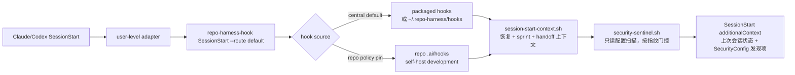
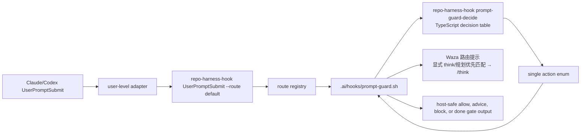

# repo-harness

Repo-local agentic development harness CLI and skill runtime for Claude/Codex
workflows.

[English](README.md) | [简体中文](README.zh-CN.md) | [日本語](README.ja.md) | [Français](README.fr.md) | [Español](README.es.md)

仓库地址：`https://github.com/Ancienttwo/repo-harness`

`repo-harness` 是一个把 AI 编程流程落到仓库文件里的工作流 harness。它既是
`repo-harness` CLI 和 skill runtime 的源码仓库，也是它自己生成给下游项目的
repo-local workflow 的自托管样例。

## 为什么用 repo-harness

- **会话状态落在文件里，不在聊天记录里。** 不同 agent 会话——Claude、Codex、现在或之后——
  靠仓库而不是聊天线程保持同步。新会话启动时 `.ai/hooks/session-start-context.sh` 注入上一会话的
  resume packet（`.ai/harness/handoff/resume.md`、`tasks/current.md`）；会话结束和每次编辑后，
  `finalize-handoff.sh`、`post-edit-guard.sh` 把下一份 handoff 写回。任务可以中途断开，下一个会话
  直接接上准确的下一步、阻塞点和改动文件，不用重新推断。
- **天生省 token。** 不靠每个会话重扫一遍仓库的 grep+read 循环，harness 用预建的 CodeGraph 索引做
  结构化查询（谁调用、调用谁、定义在哪），再用 `.ai/context/context-map.json` 和 `capabilities.json`
  做渐进式上下文加载：一份小而稳定的 root context（约 12KB），加上只在改到对应文件时才加载的
  capability 块。agent 读一份 1KB 的 capability 合约或查索引，而不是花上千 token 重新摸清结构。

## 0.4.0 新特性

- **Loop-engine 证据面。** `repo-harness-hook state-snapshot --json`、NL
  decision-table、route A/B eval 和 cutover gate 让 prompt-routing 实验可度量；
  在证据达标前，TypeScript classifier 仍是权威路径。
- **Architecture queue gate。** `scripts/architecture-queue.sh`、
  `scripts/check-architecture-sync.sh` 和扩展后的 architecture event helper
  取代已退休的 append-only drift 脚本，用派生 request index 检查 stale 架构状态。
- **Contract delegation pilot。** Contract template 新增 `budget`、
  `permission_scope`、`roles`，`scripts/contract-run.ts` 可用显式
  worker/verifier child commands 按 contract exit criteria 执行试点。
- **Heartbeat triage。** `scripts/heartbeat-triage.sh` 把定时 workflow checks、
  sprint-next 信号和 architecture request 状态写入 repo-local triage inbox。
- **Workflow asset sync。** 新 helpers、docs、tests 和 generated-repo assets
  保持 self-host runtime 与安装模板副本同步。

## 产品做什么

`repo-harness` 把 AI 辅助开发从“聊天记录里的口头协调”变成“仓库里的可审查状态”。
它会在目标仓库里安装一套小而明确的文件合约，让 Claude、Codex 和人类对下面几件事有同一个事实来源：

- 稳定的产品意图是什么
- 哪个 plan 已经批准进入执行
- 当前 sprint contract 允许改哪些范围
- 哪些 checks、review 和 evidence 证明任务真的完成
- hooks 应该如何提醒、拦截、记录 trace，并在会话之间 handoff

它不是 agent gateway、产品运行时、数据库服务或 MCP server。产品边界很清楚：
检查目标仓库，安装或刷新 workflow 文件，把 Claude/Codex 的 host events 路由到
repo-local hooks，然后验证这些 workflow surfaces 仍然一致。

## 工作原理

整体分三层：

1. **源码包层**：本仓库维护 CLI、CLI-backed command facades、templates、hook assets、
   workflow contract、tests 和 release gate。
2. **目标仓库合约层**：`repo-harness update` 或 migration 会写入 `docs/spec.md`、
   `plans/`、`tasks/`、`.ai/context/`、`.ai/harness/`、helper scripts 和
   `.ai/hooks/`。
3. **Host adapter 层**：user-level `~/.claude/settings.json` 和 `~/.codex/hooks.json`
   把 Claude/Codex events 路由到 `repo-harness-hook`。hook entrypoint 会先检查当前
   repo 是否存在 `.ai/harness/workflow-contract.json`；没有 opt in 就静默退出。有 opt in
   时按 central-first 解析 packaged install 或 `~/.repo-harness/hooks/`，repo policy
   也可以把自托管开发钉回 `.ai/hooks/*`。

对 `UserPromptSubmit` 来说，公开 adapter contract 仍然是
`repo-harness-hook UserPromptSubmit --route default`。CLI route registry 会把这个
route dispatch 到 `.ai/hooks/prompt-guard.sh`。Shell hook 继续负责 host JSON 解析、
workflow 文件读取、plan capture 副作用、quality gate 渲染，以及 host-safe
stdout/stderr。Prompt intent 和 workflow state 的决策交给
`repo-harness-hook prompt-guard-decide` 背后的 TypeScript decision engine；它从显式
decision table 里返回一个 action enum。这样 host 配置不变，但最容易出错的
classifier/state-machine 层不再散落在 shell 条件分支里。

核心不变量：持久事实在仓库里，不在聊天窗口里。Hooks 只是加速器和 guardrail；
真正的 authority 是 plan、contract、review、checks 和 handoff 这些文件。

## 任务 Workflow：从 Plan 到 Closeout

下面这张图假设目标仓库已经安装 harness。它展示的是从 program sprint backlog
到单个 contract task 的正常闭环：先选择或形成任务，再投射到执行文件，需要时
checkout 隔离 worktree，在 hooks 保护下实现，然后验证、review、external acceptance，
必要时标记 sprint task 完成，最后 closeout。0.4.0 的 loop-system surface
新增 heartbeat 定时发现、state-snapshot/eval 证据、architecture queue freshness，
以及可选的 contract-run 委派，但 source of truth 仍然是 repo 内文件合约。

```mermaid
flowchart TD
  Program["Program goal 或 release theme"] --> Sprint{"需要 sprint layer?"}
  Sprint -->|是| SprintDoc["Sprint PRD + backlog<br/>plans/prds/*.prd.md"]
  SprintDoc --> NextTask["选择下一个 sprint task<br/>sprint-backlog.sh next"]
  Sprint -->|否| UserTask["用户任务或 planning prompt"]
  Heartbeat["Heartbeat triage<br/>scripts/heartbeat-triage.sh<br/>.ai/harness/triage/"] --> UserTask
  NextTask --> UserTask

  UserTask --> Discovery["前置调查<br/>P1 map, P2 trace, P3 decision"]
  Discovery --> LoopEvidence["路由变更时的 loop evidence<br/>state-snapshot --json<br/>route-nl-vs-ts / cutover gate"]
  LoopEvidence --> PlanDraft["Draft plan<br/>plans/plan-*.md"]
  PlanDraft --> PlanReview{"Plan 是否可执行?"}
  PlanReview -->|否| Refine["收敛 scope 和 evidence contract"]
  Refine --> PlanDraft
  PlanReview -->|是| Approve["Approved plan<br/>Status: Approved"]

  Approve --> Project["投射到执行面<br/>capture-plan.sh --execute<br/>或 plan-to-todo.sh --plan"]
  Project --> Active["Active markers<br/>.ai/harness/active-plan<br/>.ai/harness/active-worktree"]
  Project --> SprintActive["Sprint projection<br/>active-sprint marker<br/>tasks/current.md"]
  Project --> Contract["Sprint contract<br/>tasks/contracts/YYYYMMDD-HHMM-task-slug.contract.md"]
  Project --> ReviewFile["Review file<br/>tasks/reviews/YYYYMMDD-HHMM-task-slug.review.md"]
  Project --> Notes["Task notes<br/>tasks/notes/YYYYMMDD-HHMM-task-slug.notes.md"]

  Contract --> Delegation["Delegation contract<br/>budget / permission_scope / roles"]
  Delegation --> Delegate{"是否使用 contract-run 委派?"}
  Delegate -->|是| ContractRun["Worker/verifier child run<br/>scripts/contract-run.ts"]
  Delegate -->|否| WorktreePolicy{"是否需要 contract worktree?"}
  WorktreePolicy -->|是| Checkout["Checkout 隔离 worktree<br/>contract-worktree.sh start --plan<br/>branch codex/task-slug"]
  WorktreePolicy -->|否| CurrentTree["使用当前 worktree<br/>小任务或明确允许的 slice"]
  Checkout --> Implement
  CurrentTree --> Implement
  ContractRun --> Changes

  Implement["编辑和运行命令"] --> PreHooks["Pre-edit guards<br/>PlanStatusGuard, ContractScopeGuard, WorktreeGuard"]
  PreHooks -->|blocked| ScopeFix["修正 plan、contract、worktree 或 scope"]
  ScopeFix --> Implement
  PreHooks -->|allowed| Changes["代码、文档、测试或配置改动"]
  Changes --> PostHooks["Post-edit / post-bash hooks<br/>trace, drift request, handoff, check evidence"]
  PostHooks --> ArchQueue["Architecture queue<br/>architecture-queue.sh record/reindex<br/>check-architecture-sync.sh"]
  ArchQueue --> Verify["运行验证<br/>tests plus repo workflow checks"]

  Verify --> Checks["结构化 evidence<br/>.ai/harness/checks/latest.json<br/>.ai/harness/runs/*.json"]
  Checks --> CheckReview["Evaluator review<br/>Waza /check -> review file"]
  CheckReview --> External["External acceptance advice<br/>或明确 manual override"]
  External --> DoneGate{"Contract、checks、review、acceptance 是否通过?"}
  DoneGate -->|否| Repair["修复失败 evidence 或实现"]
  Repair --> Implement
  DoneGate -->|是| SprintComplete{"存在 active sprint task?"}
  SprintComplete -->|是| MarkSprint["标记 backlog item 完成<br/>sprint-backlog.sh complete-task"]
  SprintComplete -->|否| Closeout["Closeout<br/>scripts/contract-worktree.sh finish"]
  MarkSprint --> Closeout

  Closeout --> Commit["提交 contract branch"]
  Commit --> Merge["Fast-forward target branch"]
  Merge --> Archive["归档 plan/todo 并刷新 handoff"]
  Archive --> Cleanup["清理已合并 worktree<br/>contract-worktree.sh cleanup"]
  Cleanup --> Done["可审查的已完成任务"]
```



## 长周期产品 Loop

Greenfield 和 Brownfield 工作先把 discovery 和工程计划前置在 Claude-Fable
中完成，不要直接让 Codex 从原始聊天长期滚动：

1. 在 Claude-Fable 里用 gstack `office-hours` 做产品 discovery，或用
   `plan-eng-review` 做工程方案评审。输出应当是锁定产品意图、架构、风险和
   evidence contract 的开发文档。
2. 把这些文档转成 `plans/prds/` 下的 PRD Sprint，并为每个 execution
   slice 写清有序 backlog 和详细 sub-plan。
3. 创建 Codex Goal，目标指向该 sprint 文件。repo-harness 之后就可以按既有
   plan -> contract -> worktree -> verification flow 逐项投射和执行。

这个交接让长周期 loop 更精准：Claude-Fable 负责前置判断，PRD Sprint 是 durable
source of truth，Codex Goal mode 只围绕具体 sprint 恢复和推进，而不是反复重新解释原始聊天。

## 前 5 分钟

这是评估一个真实仓库是否适合接入该 workflow 的最快路径。

### 初次引导

```bash
npx -y repo-harness init
```

`init` 是首次全局引导入口。它把当前 npm 包安装成全局 CLI，刷新 repo-harness
skill aliases，安装 user-level hook adapters，配置 Waza runtime skills，把 brain
root 持久化到 `~/.repo-harness/config.json`，并配置 CodeGraph MCP。它不会把当前目录
默认迁移成 repo-local workflow。

### 安装或刷新 repo-local harness

```bash
npx -y repo-harness update --dry-run
npx -y repo-harness update
```

`update` 是已有目标仓库的安装和刷新入口。从目标仓库根目录运行它，用当前 npm 包
安装或刷新 workflow files、hook assets、host adapters、skill aliases 和
repo-local verification surfaces。

npm package 和 generated workflow stamp 现在共用 `0.4.x` release line。
`repo-harness@0.4.0` 继续把首次全局引导（`repo-harness init`）
和 repo-local 刷新（`repo-harness update`）拆开，同时新增 loop-engine state
snapshot、architecture queue gate、contract delegation pilot、heartbeat triage
helper，以及这些 workflow surfaces 的 generated asset sync。
这些能力叠加在改名后的 CLI、user-level hook adapter bootstrap、AI-native scaffold overlays、
typed prompt-guard decision engine、plan-stem task artifact 命名、`REPO_HARNESS_*`
runtime aliases、Waza runtime skill sync，以及 maintainer 发布 npm 前使用的 release gate 之上。

只有维护者需要在编辑 package 源码时使用 source checkout：

```bash
git clone https://github.com/Ancienttwo/repo-harness.git ~/Projects/repo-harness
cd ~/Projects/repo-harness
bun src/cli/index.ts update
```

本地路径模型：

- 源码仓库：`~/Projects/repo-harness`
- Claude skill alias：`~/.claude/skills/repo-harness`
- Codex discoverable skill alias：`~/.codex/skills/repo-harness`

`~/Projects/repo-harness` 是唯一可编辑 source of truth。本地 Claude/Codex 路径是
symlink-backed runtime entrypoints。退休的 `repo-harness-skill` 与
`project-initializer` runtime 目录会被
`scripts/sync-codex-installed-copies.sh` 清理。

### 最小前置条件

- Git working tree
- `bash`
- `bun`，用于后续验证和 template assembly
- `jq` 可选；做 `--dry-run` 时推荐安装，应用 settings merge 时更有用

### 从这里开始

已有仓库从 repo root 执行：

```bash
npx -y repo-harness update --dry-run
```

dry-run 报告正确后再应用：

```bash
npx -y repo-harness update
```

新项目或新模块使用支线 command `repo-harness-scaffold`。已有仓库使用
`repo-harness update`；它会安装或刷新 harness，不会创建应用技术栈。

### 成功长什么样

命令最后应该输出 `=== Migration Report ===`，并包含：

- `Project hooks synced from:`：生成的 hook 行为来自哪里
- `Host hook config target: user-level ~/.claude/settings.json and ~/.codex/hooks.json`：adapter 层在哪里
- `Host hook adapters are user-level:`：提醒安装 global adapters，并信任 `~/.codex/hooks.json`
- `Workflow migration:`：repo-local harness surfaces 的创建或刷新计划
- `Helper scripts:`：应用后会得到的操作工具链
- `--- External Tooling ---`：gstack/Waza/gbrain 路由以及 advisory 安装/更新提示

### 接着跑的两个命令

```bash
bash scripts/check-task-workflow.sh --strict
bun test
```

如果 dry-run 输出不对，先停在这里，阅读
[`docs/reference-configs/hook-operations.md`](docs/reference-configs/hook-operations.md)。

## Hook Authority Map

- `.ai/hooks/` 是唯一应该优先编辑的 shared hook implementation。
- `~/.claude/settings.json` 是 user-level Claude adapter，负责 dispatch 到 opted-in repos。
- `~/.codex/hooks.json` 是 user-level Codex adapter，dispatch 到同一个 runner。
- Repo-local `.claude/settings.json` 和 `.codex/hooks.json` hook adapters 是 legacy project-level config，迁移时应退休。
- Codex 必须在 Settings 里信任 `~/.codex/hooks.json`，hooks 才会执行。
- 调试顺序：user-level adapter config -> `repo-harness-hook` 或 fallback `repo-harness hook` -> route registry -> `.ai/hooks/*`。

`SessionStart` 先按 central-first 解析 hook source，再按顺序跑两个脚本：



Prompt guard 多一个内部步骤：



Shell 层仍然拥有文件系统 authority 和副作用。TypeScript 只拥有 classifier 加
`intent x plan state` decision table。

## Hook Failure Playbook

hook block 工作时，先看 terminal 里的结构化输出。核心字段是
`guard`、`reason`、`fix`、`failure_class` 和 `run_id`。

- Failure log：`.ai/harness/failures/latest.jsonl`
- Trace log：`.claude/.trace.jsonl`
- 深入指南：[`docs/reference-configs/hook-operations.md`](docs/reference-configs/hook-operations.md)

常见 guards：

- `PlanStatusGuard`：没有 active plan，或 plan 还不能执行
- `ContractGuard`：approved execution 还没有生成 contract/review/notes scaffold
- `ContractGuard`：任务还没通过 contract verification 就声称完成
- `WorktreeGuard`：在强制 linked worktree 策略下，从 primary worktree 写入

## Repo Workflow

- Root routing docs：`CLAUDE.md`、`AGENTS.md`
- Shared hook layer：`.ai/hooks/`
- User-level adapter layer：`~/.claude/settings.json`、`~/.codex/hooks.json`
- Active execution surface：`tasks/`
- Plan source of truth：`plans/`
- Durable progress：`tasks/workstreams/`
- Release history：`docs/CHANGELOG.md`

## 当前 Release

- npm package：`repo-harness@0.4.0`
- Generated workflow stamp：`repo-harness@0.4.0+template@0.4.0`
- GitHub repository：`Ancienttwo/repo-harness`
- Release history：[`docs/CHANGELOG.md`](docs/CHANGELOG.md)

## Current Model

- Question flow 使用 **12 grouped decision points**，先推断 harness defaults。
- Plan menu 分层：**Core Plans (A-F)** 优先，**Custom Presets (G-K)** 只在需要时出现。
- Skill routing inspection-first：
  - `scripts/inspect-project-state.ts`
  - `scripts/migrate-workflow-docs.ts`
  - `assets/workflow-contract.v1.json`
- Generated repos 默认使用 repo-local harness flow：
  - `docs/spec.md -> plans/ -> tasks/contracts/ -> tasks/reviews/ -> .ai/context/context-map.json -> .ai/harness/*`
- `repo-harness init` 会刷新 runtime pieces：
  - `repo-harness` skill aliases
  - global Codex/Claude hook adapters
  - Waza skills：`think`、`hunt`、`check`、`health`
  - 持久化 brain root 到 `~/.repo-harness/config.json`
  - 配置 CodeGraph MCP
- 其他外部工具保持 advisory-only：
  - `bash scripts/check-agent-tooling.sh --host both --check-updates`
  - 不自动设置 gstack、gbrain MCP、CodeGraph daemon 或 provider

## 致谢

感谢 [Hylarucoder](https://x.com/hylarucoder) 的方法论贡献。`repo-harness`
里的 P1/P2/P3 due-diligence 方法，以及 Geju 实践对 planning、trace 和
decision rationale 的要求，来自他的贡献与启发。

感谢 [TW93](https://x.com/HiTw93) 创作 Waza；`think`、`hunt`、`check`
和 `health` 这些核心 skill 构成了 `repo-harness` 的日常 planning、bug hunt
和 verification 节奏。

感谢 [Garry Tan](https://x.com/garrytan) 创作 gstack 和 gbrain；它们影响了
product discovery、plan/design review、release 文档、knowledge sync 和
handoff retrieval 的工作流设计。

## Action Command Skills

公共 command facades 在 `assets/skill-commands/`；它们保留 host skill discovery
兼容性，真正执行由 CLI 和 hooks 负责：

- Planning / review：`repo-harness-plan`、`repo-harness-review`、`repo-harness-autoplan`
- Repo workflow actions：`repo-harness-ship`、`repo-harness-init`、`repo-harness-migrate`、`repo-harness-upgrade`、`repo-harness-capability`、`repo-harness-architecture`、`repo-harness-handoff`、`repo-harness-deploy`、`repo-harness-repair`、`repo-harness-check`
- 支线项目创建 command：`repo-harness-scaffold`

`repo-harness update` 用于已有仓库；`repo-harness-scaffold` 作为支线 command 创建新项目或模块。
`hooks-init`、`docs-init` 和 `create-project-dirs` 是内部步骤，不是公共 commands。

`repo-harness-scaffold` 保持 A-K plan catalog 作为项目类型 authority；AI-native
能力通过可选 `ai_native_profile` overlay 叠加。Webapp rendering 也是独立 overlay：
Plan B 保留为 client-only Vite；需要 public SEO/SSR landing 加 authenticated
workspace 的 React webapp 使用 Plan C，也就是一个部署在 Cloudflare Workers 上的
TanStack Start + Vite `apps/web`。`/` 走 SSR/prerender，`/app` 保持 client-only。
scaffold 不默认生成 `apps/marketing` + `apps/web` 两个前端部署。

## Maintainer Reference

### 检查本仓库 workflow contract

```bash
bash scripts/check-task-sync.sh
bash scripts/check-task-workflow.sh --strict
bun scripts/inspect-project-state.ts --repo . --format text
bash scripts/migrate-project-template.sh --repo . --dry-run
```

### Template assembly

```bash
bun scripts/assemble-template.ts --plan C --name "MyProject"
bun scripts/assemble-template.ts --target agents --plan C --name "MyProject"
```

### Verification

```bash
bun test
bash scripts/check-task-sync.sh
bash scripts/check-task-workflow.sh --strict
bun scripts/inspect-project-state.ts --repo . --format text
bash scripts/migrate-project-template.sh --repo . --dry-run
bash scripts/check-agent-tooling.sh --host both --check-updates
bun run benchmark:skills --eval route-workflow-check
```

## Key Files

- Skill spec：`SKILL.md`
- Root routing docs：`CLAUDE.md`、`AGENTS.md`
- Plan mapping：`assets/plan-map.json`
- Question-pack：`assets/initializer-question-pack.v4.json`
- Shared hooks：`assets/hooks/`
- Workflow contract：`assets/workflow-contract.v1.json`
- Hook operations reference：`docs/reference-configs/hook-operations.md`
- Template assembler：`scripts/assemble-template.ts`
- State inspector：`scripts/inspect-project-state.ts`
- Legacy-doc migrator：`scripts/migrate-workflow-docs.ts`
