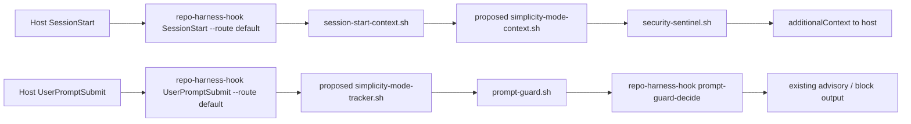

# Cherry-pick Analysis of Ponytail into Repo-harness Hooks

## Executive summary

`ponytail` and `repo-harness` solve different problems at different layers. `ponytail` is a lightweight behavioural steering package: two tiny lifecycle hooks, a small persisted mode state, a compact instruction builder, and a skill set for “lazy senior dev” decisions and over-engineering review. Its hook layer is intentionally small and host-aware, with just enough runtime logic to persist mode, inject hidden context on `SessionStart`, and update that mode on `UserPromptSubmit`. `repo-harness`, by contrast, is a much broader workflow engine: it uses a central hook dispatcher, repo-local file-backed state, prompt-intent classification, plan and contract guards, close-out orchestration, and a much heavier test surface around protocol correctness and shell/runtime behaviour. In short: `ponytail` is a good donor for **behavioural mode plumbing**, **host-output shaping patterns**, and **cross-platform hook QA**, but not for overall workflow orchestration. citeturn28view0turn28view1turn39view2turn11view0turn11view1

The highest-value cherry-pick is an **optional simplicity mode subsystem** for `repo-harness`: a small persisted mode state, `SessionStart` context injection, `UserPromptSubmit` mode toggles, and a safe deactivation parser that does not accidentally switch modes during ordinary requests. That can slot into `repo-harness` without disturbing its existing plan/contract gates, because `repo-harness` already separates advisory prompt routing from hard enforcement at the edit layer. The second-best cherry-pick is a **shared host-output helper** inspired by `ponytail-runtime.js`, but adapted to `repo-harness`’s existing `run-hook.sh` dispatcher rather than imported literally. The third is a **Windows-focused manifest and command QA suite** modelled on `ponytail`’s tests. citeturn32view0turn33view6turn31view4turn26view0turn23view2

I do **not** recommend cherry-picking `ponytail`’s hook scripts verbatim. `ponytail`’s runtime assumes Node.js is available on the non-interactive hook PATH, whereas `repo-harness`’s managed hook stack is fundamentally Bash/Bun-oriented and already has a richer dispatcher and input-parsing layer. The safest path is to port the ideas, not vendor the Node implementation wholesale. Both repositories are MIT-licensed, so licence compatibility is straightforward; the main compatibility constraint is runtime/dependency shape, not legal reuse. citeturn39view2turn20view4turn38view2turn29view2

Detailed issue and PR discussion was only visible indirectly through code comments and README references in the accessed sources. Beyond those references, issue- and PR-level rationale is unspecified here. citeturn26view1turn39view2

## The two hook architectures

`repo-harness` documents a central, route-driven hook architecture. User-level Claude and Codex adapters call a shared `repo-harness-hook` entrypoint; that entrypoint resolves central or repo-pinned hook sources, then dispatches stable route tuples such as `SessionStart.default`, `PreToolUse.edit`, `PostToolUse.edit`, `UserPromptSubmit.default`, and `Stop.default`. The README explicitly says `SessionStart.default` currently runs `session-start-context.sh` and `security-sentinel.sh`, and `UserPromptSubmit.default` routes to `prompt-guard.sh`; it also stresses that prompt-layer routing is advisory while hard enforcement lives in edit-layer guards such as `pre-edit-guard.sh`. citeturn28view0turn28view1turn28view2turn32view0turn33view6

`ponytail` is much smaller. Its hook manifests register only two lifecycle scripts: a `SessionStart` hook that runs `ponytail-activate.js`, and a `UserPromptSubmit` hook that runs `ponytail-mode-tracker.js`. The activation hook writes a mode flag file, emits hidden behavioural context, and nudges the user to configure a status-line badge if none is present. The mode-tracker hook watches user prompts for `/ponytail` mode commands, persists the new mode, and handles deactivation phrases such as `stop ponytail` and `normal mode`. citeturn11view0turn12view0turn9view0turn9view4

That difference matters. `repo-harness` already owns a large amount of durable repo truth: plans, contracts, handoff files, state snapshots, and enforcement decisions. `ponytail` does not compete with that; instead, it contributes a compact “behavioural overlay” that is a good fit for `repo-harness`’s advisory prompt/session layer. In practice, the sweet spot is to add a **steering mode** that shapes how the agent proposes or writes code, while leaving `repo-harness`’s plan, spec, and contract guards untouched. citeturn28view1turn28view2turn31view8turn32view0



The proposed flow above preserves `repo-harness`’s current layering. A `ponytail`-style mode tracker lives **before** prompt classification, and a `ponytail`-style context injector lives **between** existing session context and security scanning. That keeps the new feature small, reversible, and orthogonal to hard gates. citeturn28view1turn28view2turn31view4

## Comparison table of relevant components

| Ponytail component | Repo-harness touchpoint | Key behaviour worth cherry-picking | Licence / dependency note | Verdict |
|---|---|---|---|---|
| `hooks/ponytail-activate.js`, `hooks/claude-codex-hooks.json`, `hooks/copilot-hooks.json` citeturn9view0turn11view0turn12view0 | `SessionStart.default` documented in `README.md`; implementation in `.ai/hooks/session-start-context.sh` and `security-sentinel.sh` citeturn28view1 | Injects hidden behavioural context every session, persists active mode, and keeps startup hook small. That maps neatly onto `repo-harness`’s session advisory layer. citeturn9view0turn28view1 | MIT → MIT. Literal import would add a Node hook dependency; conceptual port to Bash/Bun is cleaner. citeturn20view4turn38view2turn39view2turn29view2 | **Cherry-pick conceptually** |
| `hooks/ponytail-mode-tracker.js` citeturn9view4 | `UserPromptSubmit.default` via `.ai/hooks/prompt-guard.sh` citeturn28view2 | Parses mode commands on prompt submit, persists state, and safely deactivates only on standalone commands. This is the single best behavioural patch to borrow. citeturn9view4turn23view2 | MIT-compatible; better reimplemented in shell/Bun to match existing stack. citeturn20view4turn38view2 | **Highest priority** |
| `hooks/ponytail-config.js` citeturn8view3 | `.ai/hooks/hook-input.sh`, policy-driven config handling in hook guards citeturn32view0turn32view7 | `normalizeMode`, `isDeactivationCommand`, config/env precedence, shell-safe path allowlist. The mode normaliser and deactivation parser are very reusable; shell-safe path validation is also worth borrowing for any future UI/status command output. citeturn8view3 | No legal problem. No extra dependency if ported. citeturn20view4turn38view2 | **Cherry-pick selected functions** |
| `hooks/ponytail-runtime.js` citeturn8view6 | `.ai/hooks/run-hook.sh` central stdout/decision filtering citeturn31view3turn31view4 | Host-aware output shaping for Claude/Codex/Copilot; mode file placement based on host env vars. `repo-harness` already has a stronger dispatcher, but a shared output helper would reduce script-local JSON formatting drift. citeturn8view6turn31view4 | Literal import pulls in Node. Better as a tiny Bash/Bun helper or CLI subcommand. citeturn39view2turn29view2 | **Cherry-pick pattern, not code** |
| `hooks/ponytail-instructions.js` + `skills/ponytail/SKILL.md` citeturn10view3turn35view0 | `session-start-context.sh`, progressive context loading, capability docs citeturn28view5turn28view1 | Builds a compact, mode-filtered instruction payload. This is a useful model for a tiny “simplicity mode” context block inside `repo-harness`, especially because `repo-harness` is token-lean by design. citeturn10view3turn28view5 | MIT-compatible; can be represented as static text or a generated capability block. citeturn20view4turn38view2 | **Cherry-pick sparingly** |
| `skills/ponytail-review/SKILL.md` citeturn36view2 | `prompt-guard`, review workflow, external acceptance advice citeturn18view4 | A narrowly scoped over-engineering review pass. Useful, but it is a skill/command concern more than a core hook-system concern. citeturn36view2 | MIT-compatible. No hook dependency issue if added as a skill. citeturn20view4turn38view2 | **Secondary, optional** |
| `tests/hooks.test.js`, `tests/hooks-windows.test.js`, `tests/behavior.test.js` citeturn26view1turn26view0turn23view6 | `tests/hook-runtime.test.ts`, `tests/hook-protocol.test.ts`, `tests/hook-shim-resolution.test.ts`, CI gate citeturn33view6turn18view6turn17view0turn29view2 | Good regression coverage for mode toggles, host-specific state paths, Windows `commandWindows` syntax, and manifest validity. This complements `repo-harness`’s already strong protocol tests. citeturn26view0turn26view1turn33view6 | No licence issue; trivial to port. citeturn20view4turn38view2 | **Cherry-pick strongly** |
| `docs/agent-portability.md` and `docs/platform-native.md` citeturn36view3turn36view5 | README hook docs and context/capability docs citeturn28view5 | “Keep adapters thin” is directly aligned with `repo-harness`’s architecture. `platform-native.md` is useful source material for a small capability block, but the full document is broader than hook plumbing. citeturn36view3turn36view5 | MIT-compatible; no runtime impact. citeturn20view4turn38view2 | **Cherry-pick docs principle, not full doc** |

## Prioritised cherry-picks

The first patch I would land is an **opt-in simplicity mode** for `repo-harness`. The mode should be persisted in repo-backed or harness-backed state, loaded on `SessionStart`, and rendered as a compact hidden context block that steers the agent towards “don’t build unnecessary things, prefer stdlib/native/platform features, and leave only one small runnable check for non-trivial logic”. This is the cleanest reuse of `ponytail` because it transfers the behaviour without disturbing `repo-harness`’s existing workflow authority. Effort is **medium** and risk is **low**, provided it is behind an explicit config flag or user command and remains advisory only. citeturn35view0turn10view3turn28view1turn28view5

The second patch is a **UserPromptSubmit mode tracker**. Borrow the `ponytail-mode-tracker.js` idea almost exactly: recognise explicit mode commands, write the active mode, and confirm the state change to the host. The key detail worth preserving is the safe deactivation parser from `ponytail-config.js`: `normal mode` should disable the feature only when it is the entire command, not when a user says something like “add a normal mode toggle”. Effort is **low to medium** and risk is **low**. citeturn9view4turn8view3turn23view2

The third patch is a **shared host-output abstraction**. `repo-harness` already has a robust dispatcher that filters Codex stdout and only forwards approved JSON for specific routes, but individual hook scripts still own a lot of output shaping. `ponytail-runtime.js` demonstrates a small, explicit contract for writing additional context to Claude, system/runtime hints to Codex, and empty objects where a host ignores output. In `repo-harness`, I would not copy the file verbatim; I would add a shell/Bun helper that all advisory hooks can call. Effort is **medium** and risk is **medium**, because this touches host-facing JSON contracts. citeturn8view6turn31view3turn31view4

The fourth patch is a **cross-platform manifest and command QA suite**, especially for Windows command syntax. `ponytail` has a very pragmatic test that forbids `%VAR%` in `commandWindows`, verifies that every referenced script actually exists, and checks that manifests point to the intended shared hook config rather than relying on auto-discovery. `repo-harness` already tests shim resolution and protocol behaviour very well; adding the `ponytail`-style host-manifest sanity checks would close a real portability gap, especially because the current `repo-harness` CI workflow only runs on Ubuntu. Effort is **low** and risk is **low**. citeturn26view0turn27view4turn18view6turn29view2

The fifth patch is a **thin-adapter documentation cleanup**. `ponytail`’s portability doc says to keep adapters thin and point hosts at shared `skills/` and `hooks/` assets whenever possible. That principle matches `repo-harness` already, but it would be worth making it explicit in the hook-system docs: one central runtime, thin host adapters, and no host-specific duplication unless a host contract truly differs. Effort is **low** and risk is **very low**. citeturn36view3turn28view0

A sixth, lower-priority patch is an **optional status-line badge** or session-visible mode indicator. `ponytail`’s activation hook detects missing status-line config and emits a setup nudge, but `repo-harness`’s current docs do not expose a comparable user-facing status-line mechanism. I would treat this as optional sugar rather than a core cherry-pick. Effort is **medium** and risk is **medium**, mostly because host/UI support is less clearly documented in the accessed `repo-harness` sources. citeturn9view0

What I would *not* cherry-pick is just as important. I would not import `ponytail`’s simpler stdin JSON handling or its blanket “silent fail” style where `repo-harness` currently relies on explicit structured errors and protocol tests. `repo-harness`’s `hook-input.sh` and protocol suite are already stricter and better aligned with its fail-closed guard model. `ponytail`’s benchmark harness and broader skill pack are interesting, but they are outside the narrow hook-system cherry-pick target. citeturn32view7turn33view6turn22view0turn39view2

## Patch-level suggestions and exact extraction points

### Recommended implementation shape

The safest implementation is a **small Bash/Bun port** of selected `ponytail` logic, not a literal copy of the Node hooks. That means adding one small mode-state library, one advisory `SessionStart` append step, and one prompt-preparse hook on `UserPromptSubmit`, while keeping `repo-harness`’s current dispatcher, plan gates, and structured-error behaviour intact. `ponytail`’s own README explicitly warns that its Claude/Codex hooks need `node` on the non-interactive PATH; `repo-harness`’s CI and runtime are already oriented around Bash, Bun, `jq`, and `rsync`, so importing Node into the hot path would be an unnecessary dependency expansion. citeturn39view2turn29view2

### Suggested patch set

Add a new file:

```diff
+++ .ai/hooks/lib/simplicity-mode.sh
+#!/bin/bash
+set -euo pipefail
+
+MODE_FILE="${HOOK_REPO_ROOT:-$(pwd)}/.ai/harness/runtime/simplicity-mode"
+DEFAULT_MODE="${REPO_HARNESS_SIMPLICITY_DEFAULT:-off}"
+
+mode_normalize() {
+  case "${1:-}" in
+    off|lite|full|ultra|review) printf '%s' "$1" ;;
+    *) return 1 ;;
+  esac
+}
+
+mode_is_deactivation_command() {
+  local t
+  t="$(printf '%s' "${1:-}" | tr '[:upper:]' '[:lower:]' | sed -E 's/[.!?[:space:]]+$//')"
+  [[ "$t" == "stop ponytail" || "$t" == "normal mode" || "$t" == "stop simplicity" ]]
+}
+
+mode_read() {
+  if [[ -f "$MODE_FILE" ]]; then
+    cat "$MODE_FILE"
+  else
+    printf '%s' "$DEFAULT_MODE"
+  fi
+}
+
+mode_write() {
+  local mode
+  mode="$(mode_normalize "${1:-}")" || return 1
+  mkdir -p "$(dirname "$MODE_FILE")"
+  printf '%s' "$mode" >"$MODE_FILE"
+}
+
+mode_clear() {
+  rm -f "$MODE_FILE"
+}
+
+mode_render_context() {
+  case "$(mode_read)" in
+    lite)  cat .ai/context/capabilities/simplicity-lite.md 2>/dev/null || true ;;
+    full)  cat .ai/context/capabilities/simplicity-full.md 2>/dev/null || true ;;
+    ultra) cat .ai/context/capabilities/simplicity-ultra.md 2>/dev/null || true ;;
+    review) cat .ai/context/capabilities/simplicity-review.md 2>/dev/null || true ;;
+    off)   : ;;
+  esac
+}
```

This ports the useful parts of `ponytail-config.js`: mode normalisation, default mode precedence, and the safe deactivation parser, but locates the state inside `repo-harness`’s own durable filesystem layout rather than in per-host plugin directories. That is the right adaptation for a repo-backed workflow harness. citeturn8view3turn28view0turn31view8

Patch `.ai/hooks/session-start-context.sh` to append the mode payload after the existing resume/handoff context is assembled, but before final output is written:

```diff
--- .ai/hooks/session-start-context.sh
+++ .ai/hooks/session-start-context.sh
@@
+. "${HOOK_REPO_ROOT:-$(pwd)}/.ai/hooks/lib/simplicity-mode.sh"
@@
 existing_context="$(build_session_context)"
+mode_context="$(mode_render_context || true)"
+
+if [[ -n "${mode_context:-}" ]]; then
+  existing_context="${existing_context}"$'\n\n'"[SimplicityMode]"$'\n'"${mode_context}"
+fi
@@
 emit_session_context_json "$existing_context"
```

This mirrors what `ponytail-activate.js` already does: write state, then emit a mode-filtered instruction block as additional hidden context on `SessionStart`. It fits naturally alongside `repo-harness`’s existing `session-start-context.sh` route. citeturn9view0turn28view1

Patch `.ai/hooks/prompt-guard.sh` at the very start, before sending prompt text into the TypeScript decision engine:

```diff
--- .ai/hooks/prompt-guard.sh
+++ .ai/hooks/prompt-guard.sh
@@
+. "${HOOK_REPO_ROOT:-$(pwd)}/.ai/hooks/lib/simplicity-mode.sh"
+USER_PROMPT="$(hook_json_get '.prompt' "$(hook_json_get '.user_message' '')")"
+
+case "$USER_PROMPT" in
+  "/ponytail lite"|"/simplicity lite"|"/lean lite")
+    mode_write lite
+    emit_user_prompt_context_json "Simplicity mode enabled: lite"
+    exit 0
+    ;;
+  "/ponytail full"|"/simplicity full"|"/lean full")
+    mode_write full
+    emit_user_prompt_context_json "Simplicity mode enabled: full"
+    exit 0
+    ;;
+  "/ponytail ultra"|"/simplicity ultra"|"/lean ultra")
+    mode_write ultra
+    emit_user_prompt_context_json "Simplicity mode enabled: ultra"
+    exit 0
+    ;;
+  "/ponytail-review"|"/simplicity review"|"/lean review")
+    mode_write review
+    emit_user_prompt_context_json "Simplicity mode enabled: review"
+    exit 0
+    ;;
+esac
+
+if mode_is_deactivation_command "$USER_PROMPT"; then
+  mode_clear
+  emit_user_prompt_context_json "Simplicity mode disabled"
+  exit 0
+fi
```

The important part here is not the command spelling; it is the sequencing. Let the mode tracker short-circuit explicit mode changes, then hand all ordinary prompts to the existing `prompt-guard`/`prompt-guard-decide` flow. That preserves `repo-harness`’s current advisory and enforcement model. The donor logic comes directly from `ponytail-mode-tracker.js` and `isDeactivationCommand`. citeturn9view4turn8view3turn28view2

Add a tiny host-output helper, but keep it in `repo-harness`’s own style. The model to copy is not the exact code in `ponytail-runtime.js`; it is the idea that host-specific JSON writing should live in one place, not in each advisory hook. `repo-harness` already centralises part of this in `run-hook.sh`, especially for Codex stdout behaviour, so the right patch is to extend that centralisation rather than introduce a parallel Node runtime. citeturn8view6turn31view3turn31view4

### Exact donor and recipient points

The most relevant donor locations in `ponytail` are these:

```text
ponytail donor files
https://github.com/DietrichGebert/ponytail/blob/main/hooks/ponytail-mode-tracker.js
https://github.com/DietrichGebert/ponytail/blob/main/hooks/ponytail-config.js
https://github.com/DietrichGebert/ponytail/blob/main/hooks/ponytail-runtime.js
https://github.com/DietrichGebert/ponytail/blob/main/hooks/ponytail-activate.js
https://github.com/DietrichGebert/ponytail/blob/main/skills/ponytail/SKILL.md
https://github.com/DietrichGebert/ponytail/blob/main/tests/hooks.test.js
https://github.com/DietrichGebert/ponytail/blob/main/tests/hooks-windows.test.js
```

The most relevant recipient locations in `repo-harness` are these:

```text
repo-harness recipient files
https://github.com/Ancienttwo/repo-harness/blob/main/.ai/hooks/prompt-guard.sh
https://github.com/Ancienttwo/repo-harness/blob/main/.ai/hooks/session-start-context.sh
https://github.com/Ancienttwo/repo-harness/blob/main/.ai/hooks/run-hook.sh
https://github.com/Ancienttwo/repo-harness/blob/main/.ai/hooks/hook-input.sh
https://github.com/Ancienttwo/repo-harness/blob/main/tests/hook-runtime.test.ts
https://github.com/Ancienttwo/repo-harness/blob/main/tests/hook-protocol.test.ts
https://github.com/Ancienttwo/repo-harness/blob/main/.github/workflows/ci.yml
```

For the recipient repository, the accessed primary sources pin the behavioural insertion points precisely: `SessionStart.default` currently resolves to `session-start-context.sh` and `security-sentinel.sh`, and `UserPromptSubmit.default` resolves to `prompt-guard.sh`; `run-hook.sh` already contains the central Codex stdout filter; `hook-input.sh` already owns shared hook input parsing; and the main protocol/runtime tests are `hook-runtime.test.ts` and `hook-protocol.test.ts`. citeturn28view1turn28view2turn31view3turn32view7turn33view6

## Compatibility and dependency notes

From a licensing perspective, the two projects are fully compatible: both expose MIT licensing in their repository metadata. There is no obvious legal blocker to code reuse, extraction, or adaptation. citeturn20view4turn38view2turn38view3

The real compatibility issue is runtime shape. `ponytail`’s hook system is explicitly built around tiny Node lifecycle hooks; its README says that the Claude Code and Codex plugins run two Node hooks and therefore require `node` on the non-interactive shell PATH. `repo-harness`, by contrast, is built around Bash hooks, a Bun-based CLI/test stack, and a central dispatcher. Adding a new Node dependency to the hook hot path would be technically possible, but it would be stylistically and operationally out of family with `repo-harness`. Port the logic; do not vendor the Node scripts wholesale. citeturn39view2turn29view2

Host compatibility is another difference. The accessed `repo-harness` sources focus on Claude and Codex adapters and mention Codex-only extra routes; `ponytail` explicitly supports Claude, Codex, GitHub Copilot CLI, Pi, Antigravity and several instruction-only hosts. If you only aim to improve `repo-harness`’s current Claude/Codex hook system, support for Copilot-style plugin data directories is optional and otherwise unspecified in the reviewed `repo-harness` sources. citeturn28view0turn28view1turn39view2turn39view3

Behaviourally, `repo-harness` is stricter than `ponytail` where it needs to be. `repo-harness`’s protocol tests explicitly assert that blocking guards must exit with code `2` and write a human-readable reason and fix to `stderr`; prompt routing is advisory, edit-layer and stop-layer guards are where enforcement lives. `ponytail` is much more permissive and often fails silently because the worst outcome for its use-case is “mode quietly did not apply”, whereas the worst outcome in `repo-harness` is “a guard silently did not protect workflow integrity”. That difference is why only selected `ponytail` patterns should be imported. citeturn33view6turn32view0turn9view0turn9view4

On the documentation side, `ponytail`’s “keep adapters thin” guidance is very compatible with `repo-harness`, because `repo-harness` already aims for a central runtime with thin user-level adapters and repo-pinned overrides only where policy requires them. That principle is worth documenting more explicitly if you add a simplicity mode subsystem. citeturn36view3turn28view0

## Testing and CI integration

The best immediate testing cherry-pick is to transplant `ponytail`’s **host-manifest sanity tests** into the `repo-harness` test suite. Specifically, add a `tests/hook-host-manifests.test.ts` that checks any host JSON/templates for three things: Windows commands use PowerShell environment syntax rather than `%VAR%`; every referenced hook script actually exists; and every host manifest points at the intended shared config rather than relying on accidental auto-discovery. Those are concise, high-value regressions that complement `repo-harness`’s existing protocol tests. citeturn26view0turn27view4turn33view6

For runtime behaviour, add new cases to `tests/hook-runtime.test.ts` modelled on `ponytail/tests/hooks.test.js`. The specific scenarios worth porting are: explicit mode changes persist; standalone deactivation commands disable the mode; incidental mentions of “normal mode” do **not** disable it; and the session-start hook injects the expected additional context when the mode is active. If you decide to support host-specific state directories later, also port the CLAUDE/Codex/Copilot state-isolation scenarios. citeturn26view1turn23view3

For parsing robustness, keep `repo-harness`’s stronger `hook-input.sh` semantics and extend its tests rather than replacing them. The current `hook-input-parse.test.ts` already verifies that malformed JSON falls back to defaults and emits a warning, while empty stdin stays silent; that is a sturdier base than `ponytail`’s direct `JSON.parse` in lifecycle hooks. If you add new mode commands, test both JSON prompt fields already used by the harness. citeturn32view8turn32view7

In CI, `repo-harness` currently runs one Ubuntu job, installs `jq` and `rsync`, sets up Bun `1.3.10`, and executes `bun run check:ci`. `ponytail`’s workflow is also single-job Ubuntu, but it runs Node `22`, Python `3.12`, installs `pandas`, checks rule-copy drift, and then runs `npm test`. The actionable lesson is not to copy the exact workflow; it is to add the new tests to the existing `check:ci` gate, and optionally add a small Windows manifest-validation job later if you want stronger host portability guarantees. citeturn29view2turn22view0

I would stage CI work in two steps. First, make the new tests pass under the existing Ubuntu `check:ci` job. Second, only after that is stable, add an optional Windows smoke lane for manifest/adapter sanity rather than full Bash-hook execution. That keeps the initial risk low while still capturing the main portability regression that `ponytail`’s tests surfaced. citeturn29view2turn26view0

## Recommended merge plan

Start with a **small, opt-in feature branch** that adds only the mode-state library, one compact mode context block, and the `UserPromptSubmit` tracking logic. Do not touch `pre-edit-guard.sh`, `stop-orchestrator.sh`, or the TypeScript decision table in the first patch. The goal of this phase is to prove that a `ponytail`-style behavioural overlay can coexist with `repo-harness`’s workflow engine without changing its enforcement semantics. citeturn28view2turn32view0turn33view6

In the next patch, refactor host-output writing into a small shared helper so advisory hooks do not each hand-roll their own JSON. Here, the source of truth is still `repo-harness`’s dispatcher contract, especially around Codex stdout filtering; `ponytail-runtime.js` is the design inspiration, not the implementation to paste. Keep the external behaviour of existing hooks unchanged while introducing the helper behind them. citeturn31view3turn31view4turn8view6

Then land the test suite expansion: runtime mode tests, deactivation regression tests, and host-manifest sanity tests. Only once those are green under `bun run check:ci` should you consider any host-expansion work such as a status line or broader portability claims. This ordering matters because `repo-harness`’s strongest asset is its disciplined protocol and regression coverage; the cherry-pick should make that stronger, not looser. citeturn17view3turn17view2turn17view4turn29view2

Finally, if the simplicity mode proves useful, document it the same way `repo-harness` documents other stable routes: keep adapters thin, point all hosts at the same shared implementation, and keep the state durable and file-backed rather than thread-backed. At that point, a later optional patch could add a dedicated over-engineering review skill modelled on `ponytail-review`, but that should come after the hook-mode plumbing is in place, not before. citeturn36view3turn36view2turn28view0

The merge order I recommend is therefore: **mode state and context injection first; prompt tracking second; output abstraction third; tests and CI hardening fourth; optional review/status features last**. That sequence extracts the highest-value parts of `ponytail` while preserving the core architecture that already makes `repo-harness` distinctive. citeturn28view0turn39view2turn29view2