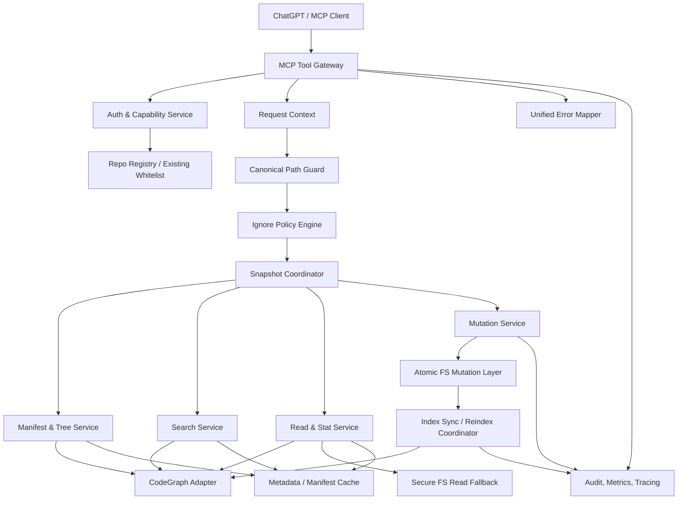

# Repo-Harness 通用仓库访问与 CodeGraph 集成 Sprint 方案

**版本：** v1.0  
**建议周期：** Sprint 0（1 周）+ Sprint 1–4（每个 2 周），共 9 周  
**适用范围：** 在现有 repo 白名单机制之上，为 GPT/MCP 提供白名单仓库内、除 `.ignore` 排除项外的完整文件枚举、搜索、读取与受控写入能力。  
**建议团队：** 2 名后端/平台工程师、1 名测试工程师、0.5 名 DevOps/SRE；Tech Lead 兼任架构评审。

---

## 1. 项目目标

### 1.1 核心目标

- [x] 白名单 repo 是首要授权边界。
- [x] 白名单 repo 内，除 `.ignore` 命中的路径外，默认允许枚举、搜索、读取。
- [x] 不按文件扩展名、隐藏目录、dotfile、`.gitignore`、`.rgignore` 或“是否属于 workflow artifact”增加额外拒绝规则。
- [x] MCP 至少提供：
  - `repo_manifest`
  - `list_tree`
  - `search_text`
  - `read_file`
  - `read_files`
  - `stat_file`
- [x] CodeGraph 作为索引、检索和仓库内容服务的主要后端。
- [x] CodeGraph 未索引但授权允许的普通文件，仍可通过安全直读 fallback 获取。
- [x] 所有读取工具共享同一套 repo、路径、ignore 和 snapshot 语义。
- [x] 写能力按 repo capability 单独启用，默认只读。
- [x] 写入使用版本前置条件、原子提交和写后索引同步，避免覆盖并发修改。
- [x] 返回结果可证明完整性、版本一致性和索引状态。

### 1.2 明确不做

- [x] 不开放任意本机文件系统路径。
- [x] 不开放 shell、进程执行或远程 Codex 执行。
- [x] 不通过 MCP 修改 repo 白名单配置本身。
- [x] 不把 CodeGraph 的“未索引”解释为“无权限”。
- [x] 不在已授权文件正文上做隐式 secret redaction；但日志中不得记录正文。
- [x] 首版不承诺解析任意二进制格式，只提供 stat、类型、哈希及可选字节分块能力。

---

## 2. 关键架构原则

1. **授权与索引分离**  
   repo-harness 决定“是否允许访问”；CodeGraph 决定“如何索引和搜索”。不得用 CodeGraph 是否返回结果代替权限判断。

2. **单一 ignore 语义**  
   所有工具共用同一个 IgnorePolicy 实例和 `ignore_digest`。默认只认仓库约定的 `.ignore`，不隐式继承其他 ignore 文件。

3. **完整性优先**  
   `repo_manifest` 是仓库可见内容的权威清单。CodeGraph 若不能完整枚举未索引文件，则由安全文件系统 walker 补齐。

4. **路径以 repo-relative 为唯一外部表示**  
   GPT 不接触本机绝对路径。所有请求使用 `repo_id + relative_path`。

5. **一致性可观察**  
   所有响应返回 `snapshot_id`、`ignore_digest`、`index_revision` 和 `stale` 状态，避免 manifest、search、read 混用不同版本。

6. **传输限制不等于权限拒绝**  
   大文件、深目录和大结果集采用分页、分块和 continuation token，不因体积大而从 manifest 中消失。

7. **写入无丢失更新**  
   覆盖、编辑、移动和删除必须携带 `expected_sha256` 或等价 revision 前置条件。

---

## 3. 目标架构



### 3.1 读取主流程

```text
MCP 请求
→ 用户与 repo capability 校验
→ repo_id 解析为 canonical root
→ relative path 规范化
→ 路径穿越与 symlink 越界检查
→ .ignore 判定
→ 绑定或创建 snapshot
→ 调用 CodeGraph
→ 对返回路径再次进行 guard + ignore 过滤
→ 必要时安全直读 fallback
→ 分页/分块序列化
→ 返回 snapshot、hash、index 状态
```

### 3.2 写入主流程

```text
MCP 写请求
→ 校验 repo 为 read_write
→ 路径和 .ignore 校验
→ 校验 expected_sha256 / must_not_exist
→ 在同目录创建临时文件或执行安全变更
→ fsync
→ atomic rename / commit
→ 生成 before/after hash 与 diff
→ 通知 CodeGraph invalidate/reindex
→ 产生新 snapshot
→ 返回写入结果和索引状态
```

---

## 4. 完整架构模块

| ID | 模块 | 核心职责 | 主要接口/产物 | 所属 Sprint |
|---|---|---|---|---|
| ARC-01 | MCP Tool Gateway | 注册工具、参数校验、超时、分页、响应序列化 | Tool schemas、handler registry | S0–S2 |
| ARC-02 | Auth & Capability Service | 用户身份、repo 访问模式、读写 capability | `canReadRepo`、`canWriteRepo` | S1、S3 |
| ARC-03 | Repo Registry | 对接现有白名单；`repo_id → canonical root` | RepoRecord、registry API | S1 |
| ARC-04 | Canonical Path Guard | 防 `..`、绝对路径、symlink escape、TOCTOU | `resolveAllowedPath` | S1 |
| ARC-05 | Ignore Policy Engine | 解析 `.ignore`，统一所有工具的排除逻辑 | matcher、`ignore_digest` | S1 |
| ARC-06 | Snapshot Coordinator | 绑定文件系统、ignore 和 CodeGraph 版本 | SnapshotRecord、stale 检测 | S2 |
| ARC-07 | CodeGraph Adapter | 封装本机 CodeGraph；能力探测、错误映射 | adapter interface | S0、S2 |
| ARC-08 | Manifest Service | 返回全部非忽略文件的权威清单 | `repo_manifest` | S2 |
| ARC-09 | Tree Service | 目录树、depth、分页、排序 | `list_tree` | S1–S2 |
| ARC-10 | Search Service | 文本/正则/路径搜索，稳定分页和上下文 | `search_text` | S2 |
| ARC-11 | Read & Stat Service | 单文件、批量、范围读取、元数据 | `read_file(s)`、`stat_file` | S1–S2 |
| ARC-12 | Secure FS Read Fallback | 读取 CodeGraph 未索引但被授权的文件 | fd-relative read API | S2 |
| ARC-13 | Mutation Service | create/write/patch/move/delete，版本前置条件 | mutation tools | S3 |
| ARC-14 | Atomic FS Mutation Layer | 临时文件、fsync、rename、回滚边界 | atomic mutation API | S3 |
| ARC-15 | Index Sync Coordinator | invalidate、增量索引、index lag 状态 | reindex events/status | S3 |
| ARC-16 | Cache Layer | manifest、stat、hash 缓存；按 snapshot 失效 | cache keys、TTL | S2–S4 |
| ARC-17 | Unified Error Model | 稳定错误码、可重试标记、部分失败 | error schema | S1 |
| ARC-18 | Audit & Observability | 调用审计、指标、trace；不记录正文 | dashboards、alerts | S3–S4 |
| ARC-19 | Feature Flags & Rollout | 并行模式、canary、回滚 | config/flags | S4 |
| ARC-20 | Test Harness | fixture repo、竞态、越界、ignore、性能测试 | CI suites | S0–S4 |
| ARC-21 | Documentation & ADR | 权限契约、工具说明、运维手册 | docs/ADR/runbook | S0–S4 |

---

## 5. MCP 工具契约

### 5.1 读取工具

| 工具 | 关键输入 | 关键输出 | 必要约束 |
|---|---|---|---|
| `repo_manifest` | `repo_id`, `snapshot_id?`, `cursor?`, `page_size?` | entries、counts、manifest digest、snapshot | 必须覆盖全部非忽略路径 |
| `list_tree` | `repo_id`, `path`, `depth`, `cursor?` | tree nodes、next cursor | hidden/dotfile 默认包含 |
| `search_text` | `repo_id`, `query`, `mode`, `paths?`, `cursor?`, `snapshot_id?` | matches、line context、file hash | 返回路径必须二次过滤 |
| `read_file` | `repo_id`, `path`, `line_range?`/`byte_range?`, `snapshot_id?` | content/chunk、sha256、continuation | 大文件分块，不静默拒绝 |
| `read_files` | `repo_id`, `requests[]`, `snapshot_id?`, `byte_budget?` | per-item result、partial failures | 单项错误不应使整批失败 |
| `stat_file` | `repo_id`, `path`, `snapshot_id?` | type、size、mtime、sha256、indexed、binary | 区分 stat/lstat 信息 |
| `get_repo_capabilities` | `repo_id` | read/write、CodeGraph 能力、限制 | 不返回本机绝对路径 |

### 5.2 写入工具

| 工具 | 关键输入 | 并发前置条件 | 输出 |
|---|---|---|---|
| `write_file` | path、content | 覆盖时 `expected_sha256`；新建时 `must_not_exist` | before/after hash、diff、index state |
| `apply_patch` | path、structured edits/unified diff | `expected_sha256` 必填 | applied hunks、diff、new hash |
| `move_path` | from、to | source hash、target must-not-exist | moved entries、index state |
| `delete_path` | path | `expected_sha256` 或 tree revision | deleted metadata、index state |
| `refresh_repo_index` | repo_id、paths? | write capability 或 admin capability | new index revision、snapshot |

### 5.3 建议响应公共字段

```json
{
  "repo_id": "repo_123",
  "snapshot_id": "snap_abc",
  "index_revision": 42,
  "ignore_digest": "sha256:...",
  "stale": false,
  "partial": false,
  "next_cursor": null
}
```

### 5.4 建议错误码

- `REPO_NOT_ALLOWED`
- `WRITE_DISABLED`
- `INVALID_RELATIVE_PATH`
- `PATH_OUTSIDE_REPO`
- `SYMLINK_ESCAPE`
- `PATH_IGNORED`
- `NOT_FOUND`
- `NOT_A_FILE`
- `BINARY_CONTENT`
- `INVALID_RANGE`
- `PAYLOAD_LIMIT_REACHED`
- `SNAPSHOT_STALE`
- `INDEX_UNAVAILABLE`
- `INDEX_STALE`
- `REVISION_CONFLICT`
- `TARGET_EXISTS`
- `PARTIAL_FAILURE`
- `INTERNAL_ADAPTER_ERROR`

错误对象必须包含：

```json
{
  "code": "REVISION_CONFLICT",
  "message": "File changed after it was read.",
  "retryable": false,
  "details": {
    "expected_sha256": "...",
    "actual_sha256": "..."
  }
}
```

---

## 6. 核心数据模型

### RepoRecord

```text
repo_id
owner_id
root_realpath                 // 仅服务端保存
access_mode                   // read_only | read_write
enabled
codegraph_project_id
ignore_policy_version
created_at
updated_at
registry_revision
```

### SnapshotRecord

```text
snapshot_id
repo_id
fs_revision
codegraph_revision
ignore_digest
manifest_digest
created_at
state                         // ready | index_lagging | stale | failed
```

### ManifestEntry

```text
path                          // repo-relative
type                          // file | dir | symlink
size
mtime
sha256
mime
binary
indexed
readable
writable
symlink_target_kind           // internal | external | none
```

### MutationRecord

```text
mutation_id
repo_id
operation
paths
expected_hashes
before_hashes
after_hashes
actor_id
committed_at
index_state                   // pending | ready | failed
new_snapshot_id
```

---

# 7. Sprint 0：契约冻结与 CodeGraph 技术验证

**周期：** 1 周  
**目标：** 在进入生产开发前冻结权限语义、CodeGraph 能力边界和工具契约，避免后续因“索引不完整”“ignore 不一致”返工。

## 7.1 架构与产品契约

- [x] **S0-ARC-001** 编写 ADR：repo 白名单是授权边界，`.ignore` 是唯一内容级排除规则。
- [x] **S0-ARC-002** 明确 `.ignore` 语法：建议采用 gitignore pattern 语义，但不自动加载 `.gitignore`/`.rgignore`。
- [x] **S0-ARC-003** 明确隐藏文件、dotfile 和未知扩展名默认可见。
- [x] **S0-ARC-004** 明确 symlink 规则：目标仍在同一 canonical repo root 内时允许；越界拒绝。
- [x] **S0-ARC-005** 明确读写 capability：repo 默认 `read_only`，显式升级为 `read_write`。
- [x] **S0-ARC-006** 明确传输限制策略：分页/分块，不将大小限制解释为内容拒绝。
- [x] **S0-ARC-007** 明确已授权正文不做隐式脱敏；日志严禁记录正文。
- [x] **S0-ARC-008** 冻结公共错误模型、分页模型和 snapshot 字段。

## 7.2 CodeGraph Spike

- [x] **S0-CG-001** 列出本机 CodeGraph 当前 API/CLI/SDK 能力。
- [x] **S0-CG-002** 验证 CodeGraph 是否能枚举“全部文件”，包括未索引文件、dotfile 和未知扩展名。
- [x] **S0-CG-003** 验证 literal、regex、path search 能力和分页稳定性。
- [x] **S0-CG-004** 验证能否按行/字节读取，是否能返回文件 hash/revision。
- [x] **S0-CG-005** 验证索引 revision、刷新、invalidate 和增量 reindex 能力。
- [x] **S0-CG-006** 验证新建、修改、移动、删除后的索引可见延迟。
- [x] **S0-CG-007** 形成 capability matrix：native / adapter-emulated / filesystem-fallback / unsupported。
- [x] **S0-CG-008** 决定 manifest 的 source of truth：CodeGraph 全量 inventory 或 secure walker + CodeGraph metadata merge。

## 7.3 测试基线

- [x] **S0-TST-001** 建立 fixture repo，包含普通文件、dotfile、空文件、超大文件、二进制、未知扩展名。
- [x] **S0-TST-002** 加入 `.ignore` 的包含、排除、否定规则和嵌套目录案例。
- [x] **S0-TST-003** 加入 `../`、绝对路径、内部 symlink、外部 symlink、symlink chain。
- [x] **S0-TST-004** 加入并发修改、删除后读取、写入时 rename 的竞态用例。
- [x] **S0-TST-005** 建立大仓库基准：10k、100k、500k entries。
- [x] **S0-TST-006** 在 CI 中提供可重复启动的 fake CodeGraph 或 adapter contract test double。

## 7.4 Sprint 0 退出标准

- [ ] 所有 ADR 经架构评审通过。
- [x] CodeGraph capability matrix 无未知关键项。
- [x] 已明确何时启用安全文件系统 fallback。
- [x] MCP 工具 JSON Schema 进入版本控制。
- [x] Fixture repo 和最小 adapter spike 可在 CI 运行。
- [x] 无 P0/P1 未决权限问题。

Sprint 0 evidence:

- ADR: `docs/architecture/decisions/20260622-general-repo-codegraph-access.md`
- Capability matrix and local spike: `docs/researches/20260622-codegraph-capability-matrix.md`
- MCP schema: `assets/mcp/general-repo-reader-tools.v1.schema.json`
- Fixture and contract tests: `tests/fixtures/mcp-codegraph-access/`, `tests/cli/mcp-codegraph-contract.test.ts`
- Verification: `bun test tests/cli/mcp-codegraph-contract.test.ts`
- Remaining exit gate: architecture reviewer sign-off through the Sprint 0 PR.

---

# 8. Sprint 1：安全边界与基础读取 MVP

**周期：** 2 周  
**目标：** 打通现有白名单、路径守卫、`.ignore`、基础 tree/stat/read，并证明“不额外阻拦”。

## 8.1 Repo Registry 与 capability

- [x] **S1-REG-001** 对接现有 repo 白名单，不复制第二份授权源。
- [x] **S1-REG-002** 使用稳定 `repo_id`，外部 API 禁止提交本机绝对路径。
- [x] **S1-REG-003** 在 Registry 中支持 `read_only | read_write`，初始默认 `read_only`。
- [x] **S1-REG-004** 为 repo root 建立 canonical realpath，并检测 root 被移动/替换。
- [x] **S1-REG-005** 实现 registry revision 和配置变更审计。

## 8.2 Path Guard

- [x] **S1-GRD-001** 拒绝绝对路径、NUL、非法编码和 `..` 越界。
- [x] **S1-GRD-002** 路径标准化后再次验证仍在 repo root 内。
- [x] **S1-GRD-003** 支持内部 symlink；拒绝 external symlink 和 symlink chain escape。
- [x] **S1-GRD-004** 写路径对不存在目标检查最近的已存在父目录。
- [x] **S1-GRD-005** 使用 fd-relative/openat 等机制降低 check-then-open TOCTOU 风险。
- [x] **S1-GRD-006** 对 CodeGraph 返回的每个 path 执行二次 guard。
- [x] **S1-GRD-007** 增加 Windows/macOS/Linux 路径差异测试；若首版只支持单平台，在 capability 中显式声明。

## 8.3 Ignore Policy

- [x] **S1-IGN-001** 实现 `.ignore` parser 和 matcher。
- [x] **S1-IGN-002** 计算稳定 `ignore_digest`。
- [x] **S1-IGN-003** 所有服务注入同一个 IgnorePolicy，不允许各模块自行解析。
- [x] **S1-IGN-004** 不自动继承 `.gitignore`、`.rgignore` 或 CodeGraph 默认 ignore。
- [x] **S1-IGN-005** dotfile 和隐藏目录默认包含。
- [x] **S1-IGN-006** `.ignore` 变化时使 manifest/cache/snapshot 失效。
- [x] **S1-IGN-007** 为否定规则、目录规则、尾部斜杠、转义和 Unicode 路径建立测试。

## 8.4 基础工具

- [x] **S1-API-001** 实现 `get_repo_capabilities`。
- [x] **S1-API-002** 实现 `stat_file`，返回 type、size、mtime、hash、indexed 状态。
- [x] **S1-API-003** 实现 `read_file` 首版，支持 line range 和 byte range。
- [x] **S1-API-004** 实现 `list_tree` 首版，支持 path、depth、分页。
- [x] **S1-API-005** 确保 `.env`、dotfile、未知扩展名在未被 `.ignore` 命中时可以 stat/read/list。
- [x] **S1-API-006** 为超出单次响应预算的内容返回 continuation token。
- [x] **S1-API-007** 实现统一 error mapper 和 retryable 标记。
- [x] **S1-API-008** 在响应中加入 repo、ignore 和初步 revision 元数据。

## 8.5 测试与文档

- [x] **S1-TST-001** 路径穿越、symlink escape、大小写、Unicode、长路径单测。
- [x] **S1-TST-002** `.ignore` golden tests。
- [x] **S1-TST-003** 白名单 repo 与非白名单 repo 的访问隔离测试。
- [x] **S1-TST-004** 验证不再存在 artifact-only、extension allowlist、hidden-file block。
- [x] **S1-DOC-001** 编写权限契约和基础工具使用文档。
- [x] **S1-DOC-002** 更新 MCP server instructions，移除“只读 workflow artifacts”的旧描述。

## 8.6 Sprint 1 退出标准

- [x] 任意白名单 fixture repo 的全部非忽略普通文件均可通过 tree → stat → read 访问。
- [x] 非白名单 repo 和 repo 外 symlink 100% 拒绝。
- [x] `.ignore` 在 tree、stat、read 三个工具中的结果完全一致。
- [x] 所有响应不暴露绝对路径。
- [x] 单元测试覆盖率达到团队门槛；路径和 ignore 核心模块建议 ≥ 90%。
- [x] 无高危路径逃逸问题。

Sprint 1 evidence:

- Runtime: `src/cli/mcp/general-repo-access.ts`, `src/cli/mcp/reader-tools.ts`, `src/effects/repo-registry.ts`
- Tests: `tests/cli/mcp-reader-tools.test.ts`, `tests/cli/mcp-policy.test.ts`, `tests/cli/mcp-tools.test.ts`
- Docs: `docs/repo-harness-chatgpt-mcp-setup.md`, `README.md`
- Verification: `bun test tests/cli/mcp-reader-tools.test.ts tests/cli/mcp-tools.test.ts tests/cli/mcp-policy.test.ts tests/cli/mcp-codegraph-contract.test.ts`
- Deferred by design: `S1-GRD-004` is completed with Sprint 3 write tools; `S1-GRD-006` is completed with the Sprint 2 CodeGraph adapter because Sprint 1 has no CodeGraph path-returning adapter call yet.

---

# 9. Sprint 2：CodeGraph、完整 Manifest、搜索与 Snapshot

**周期：** 2 周  
**目标：** 建立生产级 CodeGraph Adapter，提供全面分析所需的完整 inventory、搜索、批量读取与一致 snapshot。

## 9.1 CodeGraph Adapter

- [x] **S2-CG-001** 定义稳定 adapter interface，隔离 CodeGraph 具体版本和调用方式。
- [x] **S2-CG-002** 启动时执行 capability discovery，并缓存结果。
- [x] **S2-CG-003** 统一 CodeGraph timeout、取消、重试和错误映射。
- [x] **S2-CG-004** 所有返回路径执行 canonical guard 和 `.ignore` 二次过滤。
- [x] **S2-CG-005** 记录 adapter latency、failure 和 index revision 指标。
- [x] **S2-CG-006** 对 CodeGraph 不支持的能力提供明确 fallback，而非静默缺失。
- [x] **S2-CG-007** 建立 adapter contract tests，可替换 fake/real CodeGraph。

## 9.2 Snapshot Coordinator

- [x] **S2-SNP-001** 定义 `snapshot_id` 生命周期。
- [x] **S2-SNP-002** snapshot 绑定 `fs_revision + codegraph_revision + ignore_digest`。
- [x] **S2-SNP-003** manifest、tree、search、read、batch read 可复用同一 snapshot。
- [x] **S2-SNP-004** 文件或 ignore 变化时标记 snapshot stale。
- [x] **S2-SNP-005** stale 时返回显式状态；禁止静默混合版本。
- [x] **S2-SNP-006** 定义 snapshot TTL、最大并发数和清理策略。
- [x] **S2-SNP-007** 为“索引落后于文件系统”提供 `index_lagging` 状态。

## 9.3 Repo Manifest

- [x] **S2-MAN-001** 实现 `repo_manifest`，覆盖所有非忽略 entries。
- [x] **S2-MAN-002** 每项包含 `indexed/readable/binary/size/mtime/hash/type`。
- [x] **S2-MAN-003** CodeGraph inventory 不完整时，由 secure walker 补齐。
- [x] **S2-MAN-004** 合并 CodeGraph metadata 和文件系统 metadata，定义冲突优先级。
- [x] **S2-MAN-005** 支持稳定排序、分页、cursor 和 manifest digest。
- [x] **S2-MAN-006** 返回总文件数、目录数、文本/二进制数、未索引数。
- [x] **S2-MAN-007** 仅在完整遍历成功时返回 `complete: true`。
- [x] **S2-MAN-008** 对遍历中发生的变化返回 stale/partial，而不是伪造完整性。
- [x] **S2-MAN-009** 建立 manifest parity test：期望集合与实际集合逐项对比。

## 9.4 搜索与批量读取

- [x] **S2-SRC-001** 实现 `search_text` literal 模式。
- [x] **S2-SRC-002** 实现 regex 模式；限制复杂度但不按路径或扩展名过滤。
- [x] **S2-SRC-003** 支持 path include filter；filter 只能缩小用户主动请求，不得成为隐式 policy。
- [x] **S2-SRC-004** 返回行号、上下文、文件 hash、snapshot。
- [x] **S2-SRC-005** 支持稳定分页和 continuation。
- [x] **S2-SRC-006** CodeGraph 搜索不可用时提供受限 filesystem search fallback，并保持同一 ignore 语义。
- [x] **S2-RD-001** 实现 `read_files`。
- [x] **S2-RD-002** 支持 per-file range、全局 byte budget 和 partial success。
- [x] **S2-RD-003** CodeGraph 未索引但授权允许的文本使用 secure read fallback。
- [x] **S2-RD-004** 二进制文件默认返回 metadata；可选开放 byte chunk。
- [x] **S2-RD-005** 为读取结果返回 sha256，供后续写前置条件使用。

## 9.5 性能与缓存

- [x] **S2-PERF-001** manifest 流式生成，不将全仓库一次性载入内存。
- [x] **S2-PERF-002** cache key 包含 repo、snapshot、ignore digest 和路径。
- [x] **S2-PERF-003** 文件变化、ignore 变化、registry 变化时精确失效。
- [x] **S2-PERF-004** 在 10k/100k/500k entries fixture 上记录基线。
- [x] **S2-PERF-005** 建议初始目标：100k 文件 warm manifest 首屏 p95 < 2s；普通 read 首块 p95 < 500ms；warm search p95 < 2s。最终以环境基线调整。

## 9.6 Sprint 2 退出标准

- [x] Manifest 与真实非忽略文件集合在 fixture 中达到 100% parity。
- [x] 未索引文件仍会出现在 manifest，并可在授权条件下读取。
- [x] 同一 snapshot 中 manifest/search/read 的 hash 一致。
- [x] CodeGraph 返回越界或已忽略路径时被二次过滤。
- [x] search 不因 dotfile、扩展名或 `.gitignore` 漏结果。
- [x] 100k 文件规模下无 OOM，所有大结果均可分页恢复。
- [x] CodeGraph 故障时错误清晰；允许 fallback 的路径可降级运行。

Sprint 2 adapter/snapshot evidence:

- Runtime: `src/cli/mcp/codegraph-adapter.ts`, `src/cli/mcp/general-repo-access.ts`, `src/cli/mcp/reader-tools.ts`
- Tests: `tests/cli/mcp-reader-tools.test.ts`
- Verification: `bun test tests/cli/mcp-reader-tools.test.ts`, `bun run check:type`
- Snapshot cache/index-lag update: responses now expose `snapshot_state`, creation/expiry, TTL, bounded snapshot metadata, and CodeGraph lagging path summaries. Snapshot memoization is repo-wide and revalidated by the current manifest digest, so it closes `S2-SNP-006/007` but does not claim the per-path cache requirements in `S2-PERF-002/003`.
- Cache-key/performance update: public `snapshot_cache.key` is scoped by tool and repo-relative path set, with `snapshot_cache.snapshot_key` naming the underlying snapshot. Entry metadata cache keys include repo id, registry revision, `.ignore` digest, path, and current stat signature, so file, `.ignore`, and registry changes do not reuse stale metadata. Verification: `bun test tests/cli/mcp-reader-tools.test.ts tests/cli/mcp-codegraph-contract.test.ts`, `bun run check:type`, and `bun run benchmark:mcp-reader -- --entries 10000 --json`.
- Performance update: the manifest walker now avoids the per-entry `resolveRepoPath` hot path, and explicit `snapshot_id` stat/read calls reuse cached snapshots with requested-file hash validation instead of rebuilding the full repo snapshot. The 100k benchmark completes without OOM, returns paginated results, and meets the warm-path SLO on this machine: manifest 733.76 ms, read first chunk 0.74 ms, search 779.04 ms. Verification: `bun test tests/cli/mcp-reader-tools.test.ts tests/cli/mcp-codegraph-contract.test.ts`, `bun run check:type`, and `bun run benchmark:mcp-reader -- --entries 100000 --json`.
- Streaming manifest update: `repo_manifest` now traverses the visible tree to prove counts and digest while retaining only the requested page entries. Non-page file content metadata is deferred and exposed via `counts.content_deferred`; returned manifest entries, `stat_file`, `read_file`, and `search_text` still compute content hashes when content is returned. The 10k/100k/500k baselines are recorded in `docs/researches/20260623-general-repo-reader-performance-baseline.md`; the 500k fixture now completes without OOM with a recorded warm manifest baseline of 12201.90 ms and read first chunk of 3.67 ms. CodeGraph CLI `query` remains symbol-oriented, so full-text `search_text` continues to use the policy-consistent filesystem fallback while exposing CodeGraph indexed metadata.

---

# 10. Sprint 3：写入平面、并发控制与索引同步

**周期：** 2 周  
**目标：** 在 repo 级 `read_write` capability 下提供可审计、无丢失更新、写后可检索的变更能力。

## 10.1 写 capability 与 API

- [x] **S3-CAP-001** repo 默认保持 `read_only`。
- [x] **S3-CAP-002** 只有现有授权系统显式配置 `read_write` 时才注册/允许写工具。
- [x] **S3-CAP-003** 写请求复用同一 Path Guard 和 IgnorePolicy。
- [x] **S3-API-001** 实现 `write_file` create/replace。
- [x] **S3-API-002** 实现 `apply_patch`，优先结构化 edits，必要时支持 unified diff。
- [x] **S3-API-003** 实现 `move_path`。
- [x] **S3-API-004** 实现 `delete_path`。
- [x] **S3-API-005** 定义目录创建、空目录和递归删除策略；递归删除建议首版默认关闭或要求显式参数。
- [x] **S3-API-006** 写响应返回 before/after hash、diff、mutation id 和 index state。

## 10.2 乐观并发与原子写

- [x] **S3-MUT-001** 覆盖已有文件必须提交 `expected_sha256`。
- [x] **S3-MUT-002** 新建必须提交 `must_not_exist: true`。
- [x] **S3-MUT-003** hash 不匹配返回 `REVISION_CONFLICT`，禁止自动覆盖。
- [x] **S3-MUT-004** 临时文件必须位于目标同一文件系统/目录边界。
- [x] **S3-MUT-005** 写临时文件 → fsync → atomic rename。
- [x] **S3-MUT-006** 保留原文件权限和必要 metadata，策略写入 ADR。
- [x] **S3-MUT-007** patch 应验证每个 hunk 或精确文本 precondition。
- [x] **S3-MUT-008** move/delete 同样进行版本和目标存在性检查。
- [x] **S3-MUT-009** 写失败不得留下半文件或跨 repo 临时文件。
- [x] **S3-MUT-010** 对写入过程进行故障注入测试：磁盘满、权限变化、进程中断、rename 失败。

## 10.3 Index Sync

- [x] **S3-IDX-001** 每次成功 mutation 产生 index invalidation event。
- [x] **S3-IDX-002** 能按 path 增量 reindex 时优先使用；否则明确使用 repo refresh。
- [x] **S3-IDX-003** 写后返回 `index_state: pending|ready|failed`。
- [x] **S3-IDX-004** 索引完成后生成新 `codegraph_revision` 和 snapshot。
- [x] **S3-IDX-005** 在索引 pending 时，changed path 的 read/stat 走安全直读并返回最新 hash。
- [x] **S3-IDX-006** search 必须明确使用旧索引还是等待新索引；禁止假装已可搜。
- [x] **S3-IDX-007** 实现 `refresh_repo_index` 或内部等价管理接口。
- [x] **S3-IDX-008** 定义 reindex retry、dead-letter 和人工恢复流程。
- [x] **S3-IDX-009** 监控 mutation commit 到 CodeGraph 可搜索的 index lag。

## 10.4 审计

- [x] **S3-AUD-001** 审计 actor、repo_id、operation、relative paths、hash、结果和耗时。
- [x] **S3-AUD-002** 不记录文件正文、patch 全文或 secret。
- [x] **S3-AUD-003** 审计日志与应用日志分离并设置保留策略。
- [x] **S3-AUD-004** mutation id 可追踪到索引刷新状态。
- [x] **S3-AUD-005** 对拒绝的写请求记录错误码，不记录内容。

## 10.5 Sprint 3 退出标准

- [x] 所有写工具在 read-only repo 中可靠拒绝。
- [x] 100% 检测并发覆盖冲突，无 lost update。
- [x] 原子写故障注入不产生半写文件。
- [x] 写后 stat/read 立即可见最新内容。
- [x] 写后 search 在定义的 index lag SLO 内可见，或明确返回 pending。
- [x] move/delete 后 manifest 与索引最终一致。
- [x] 所有写操作可通过 mutation id 审计。

Sprint 3 write_file evidence:

- Runtime: `src/cli/mcp/general-repo-access.ts`
- Tests: `tests/cli/mcp-reader-tools.test.ts`
- Schema/docs: `assets/mcp/general-repo-reader-tools.v1.schema.json`, `README.md`, `docs/repo-harness-chatgpt-mcp-setup.md`
- Completed slice: `write_file` create/replace is gated by registered repo
  `read_write`, reuses the general repo Path Guard and `.ignore` policy,
  requires `must_not_exist` for create and `expected_sha256` for replace,
  writes through a same-directory temporary file plus fsync/atomic rename, and
  returns `mutation_id`, `before`, `after`, `diff`, and `index_state`.
- Verified in this slice: success, precondition-conflict, and injected
  pre-commit fault paths leave no `.repo-harness-*` temporary files in the
  target directory and preserve the old file or absent target state.
- Fault coverage: deterministic fault points cover temp-write-after-fsync before
  rename, move before rename, and delete before unlink. These model disk-full,
  permission-change, interrupted-process, and rename-failure boundaries before a
  filesystem commit.

Sprint 3 index-sync evidence:

- Runtime: `src/cli/mcp/general-repo-access.ts`,
  `src/cli/mcp/codegraph-adapter.ts`
- Tests: `tests/cli/mcp-reader-tools.test.ts`,
  `tests/cli/mcp-codegraph-contract.test.ts`
- Schema/docs: `assets/mcp/general-repo-reader-tools.v1.schema.json`,
  `README.md`, `docs/repo-harness-chatgpt-mcp-setup.md`,
  `docs/architecture/decisions/20260622-general-repo-codegraph-access.md`,
  `tasks/notes/20260622-repo-harness-codegraph.notes.md`
- Completed slice: `refresh_repo_index` is exposed only for `read_write` repos,
  validates requested paths through the same guard/`.ignore` policy, calls
  CodeGraph refresh, invalidates local snapshots, and returns before/after index
  revisions plus a fresh snapshot.
- The bundled adapter uses repo-level `codegraph sync` when path incremental
  refresh is unavailable and reports `path_refresh_supported:false`.
- Pending-state reads/stat use filesystem truth and return the latest hash;
  `search_text` keeps the explicit CodeGraph-metadata plus guarded filesystem
  fallback backend instead of claiming the changed path is already indexed.
- Successful mutations now append `.ai/harness/mcp/index-events.jsonl`
  invalidation events with mutation id, invalidation id, relative paths, hash
  summaries, retry metadata, and the refresh tool. `refresh_repo_index` accepts
  the returned `mutation_id`, accepts recently deleted paths for move/delete
  refresh, records refresh success or dead-letter failure, and reports
  mutation-to-refresh lag when the source event is in the recent event window.
- Manual recovery for dead-letter refresh is documented as retrying
  `refresh_repo_index`, then running `bash scripts/ensure-codegraph.sh --sync`
  before retrying the tool if the adapter remains unavailable.

Sprint 3 apply_patch evidence:

- Runtime: `src/cli/mcp/general-repo-access.ts`
- Tests: `tests/cli/mcp-reader-tools.test.ts`,
  `tests/cli/mcp-codegraph-contract.test.ts`
- Schema/docs: `assets/mcp/general-repo-reader-tools.v1.schema.json`,
  `README.md`, `docs/repo-harness-chatgpt-mcp-setup.md`,
  `docs/architecture/decisions/20260622-general-repo-codegraph-access.md`,
  `tasks/notes/20260622-repo-harness-codegraph.notes.md`
- Completed slice: `apply_patch` is exposed only for `read_write` repos,
  targets existing text files, requires `expected_sha256`, supports structured
  `old_text`/`new_text` edits plus guarded unified diff hunks, and returns the
  shared mutation readback with `before`, `after`, `diff`, `mutation_id`, and
  `index_state`.
- Patch preconditions are fail-closed: stale file hash, ambiguous structured
  match without `occurrence`, missing text, and hunk mismatch return
  `REVISION_CONFLICT` before writing.
- Metadata policy: existing file mode bits are preserved. Filesystem mtime
  changes as part of the commit; ownership, xattrs, and platform-specific
  metadata are out of scope for the portable v1 mutation layer.

Sprint 3 move/delete path mutation evidence:

- Runtime: `src/cli/mcp/general-repo-access.ts`
- Tests: `tests/cli/mcp-reader-tools.test.ts`,
  `tests/cli/mcp-codegraph-contract.test.ts`
- Schema/docs: `assets/mcp/general-repo-reader-tools.v1.schema.json`,
  `README.md`, `docs/repo-harness-chatgpt-mcp-setup.md`,
  `docs/architecture/decisions/20260622-general-repo-codegraph-access.md`,
  `tasks/notes/20260622-repo-harness-codegraph.notes.md`
- Completed slice: `move_path` and `delete_path` are exposed only for
  `read_write` repos and reuse the same repo registry, Path Guard, `.ignore`,
  snapshot invalidation, audit hash, and pending CodeGraph refresh contract as
  `write_file` and `apply_patch`.
- `move_path` is regular-file only, requires the source `expected_sha256`,
  rejects stale hashes, requires an existing target parent directory, and
  requires `must_not_exist: true` so target collisions return `TARGET_EXISTS`
  before `rename`.
- `delete_path` is regular-file only, requires `expected_sha256`, returns the
  deleted metadata, and rejects stale hashes before removing the file.
- Directory policy for v1 is now explicit: write tools do not create parent
  directories; empty-directory mutation is unsupported; recursive delete is
  disabled and returns a stable policy error before any filesystem mutation.

Sprint 3 failure-injection and audit evidence:

- Runtime: `src/cli/mcp/general-repo-access.ts`, `src/cli/mcp/types.ts`,
  `src/cli/mcp/setup.ts`
- Tests: `tests/cli/mcp-reader-tools.test.ts`,
  `tests/cli/mcp-codegraph-contract.test.ts`, `tests/cli/mcp-setup.test.ts`
- Docs/schema: `assets/mcp/general-repo-reader-tools.v1.schema.json`,
  `.gitignore`, `README.md`, `docs/repo-harness-chatgpt-mcp-setup.md`,
  `docs/architecture/decisions/20260622-general-repo-codegraph-access.md`
- Completed slice: deterministic test-only mutation fault points verify
  create/replace/patch abort after temp fsync but before rename, move aborts
  before rename, and delete aborts before unlink. All fault cases leave no
  committed partial file and no same-directory repo-harness temp residue.
- The MCP audit log remains separate at `.ai/harness/mcp/audit.log`; the index
  event/recovery log is separate ignored runtime state at
  `.ai/harness/mcp/index-events.jsonl`. Both are managed by MCP setup ignore
  entries. Audit records actor/profile, repo id, operation, relative paths, hash
  summaries, result, duration, mutation id, index invalidation id, index event id,
  and rejection error code without storing file bodies, patch text, or secret
  error strings.

---

# 11. Sprint 4：安全加固、可观测性、迁移与发布

**周期：** 2 周  
**目标：** 在真实仓库上完成兼容验证、性能调优、灰度、文档和生产发布。

## 11.1 安全与一致性加固

- [x] **S4-SEC-001** 独立安全评审：path traversal、symlink、TOCTOU、权限提升、日志泄露。
- [x] **S4-SEC-002** Fuzz path parser、ignore parser 和 patch parser。
- [x] **S4-SEC-003** 测试 repo root 在运行期间被替换、卸载或权限变化。
- [x] **S4-SEC-004** 测试 CodeGraph 返回恶意/异常 path。
- [x] **S4-SEC-005** 测试 manifest 生成期间文件大量变更。
- [x] **S4-SEC-006** 确认所有内容大小限制均返回 continuation 或明确错误，不造成隐式文件消失。
- [x] **S4-SEC-007** 确认内容不进入 trace、metrics label 或 error stack。

Sprint 4 security hardening evidence:

- Runtime: `src/cli/mcp/general-repo-access.ts`
- Tests: `tests/cli/mcp-reader-tools.test.ts`
- Completed slice: repo records now capture first-observed root identity and
  reject the same repo id if the root disappears or is replaced at the same
  canonical path during a long-lived MCP process. This supplements canonical
  realpath checks without changing the external `repo_id + relative_path`
  contract.
- Parser hardening tests cover traversal, absolute paths, Windows-like paths,
  NUL bytes, ignored refresh paths, guarded unified diff rejection, and existing
  `.ignore` golden behavior.
- CodeGraph adapter safety tests cover malicious absolute, Windows-like, NUL,
  ignored, missing, and traversal paths; every such adapter path is filtered
  before metadata merge and never becomes readable content.
- Manifest consistency tests cover disappearing entries through dangling
  symlinks and POSIX permission-denied directories. The manifest remains
  explicit with `partial:false|true`, `complete:false`, and `walker_errors`
  rather than silently dropping entries as complete.
- Payload-limit tests cover `read_file` continuation and `read_files`
  byte-budget exhaustion with `PAYLOAD_LIMIT_REACHED`, so large content does
  not disappear from the API as a permission denial.
- Error/audit hardening now redacts generic thrown adapter errors and
  blocked `GeneralRepoAccessError` messages before MCP response and audit
  emission. Existing audit writer redaction remains a second defensive layer;
  index event errors already use the same redaction path.
- Independent Claude read-only review was run on the S4 security diff. The
  first pass found one P1 redaction consistency issue in the blocked audit path;
  after fixing it, the second pass reported no P1 findings. Remaining review
  notes are low-risk: root identity relies on filesystem inode/birthtime
  behavior, and POSIX permission-denied assertions are skipped when tests run
  as root.

## 11.2 可观测性

- [x] **S4-OBS-001** 指标：tool calls、latency、bytes、errors、partial、fallback rate。
- [x] **S4-OBS-002** 指标：manifest parity failures、snapshot stale rate、index lag。
- [x] **S4-OBS-003** 指标：write conflicts、atomic write failures、reindex failures。
- [x] **S4-OBS-004** Dashboard：按 repo、tool、CodeGraph revision 聚合。
- [x] **S4-OBS-005** 告警：路径逃逸尝试突增、index lag 超阈值、manifest incomplete、reindex dead-letter。
- [x] **S4-OBS-006** tracing：MCP → policy → CodeGraph/FS → response，全链路 correlation id。

Sprint 4 observability evidence:

- Runtime: `src/cli/mcp/general-repo-access.ts`
- Report script: `scripts/mcp-observability-report.ts`
- Tests: `tests/cli/mcp-reader-tools.test.ts`,
  `tests/mcp-observability-report.test.ts`, `tests/cli/mcp-setup.test.ts`
- Every general repo MCP tool call now receives a `correlation_id` in the MCP
  response and audit entry. The same id is written to
  `.ai/harness/mcp/metrics.jsonl` and `.ai/harness/mcp/trace.jsonl`, so an
  operator can join MCP response, audit, metrics, and trace rows without using
  local absolute paths.
- Metrics cover tool, repo id, status, duration, CodeGraph revision/latency,
  bytes returned/written, partial result, fallback usage, manifest parity
  mismatches, snapshot stale errors, index lag, write conflicts, atomic write
  failures, reindex failures, and path-escape attempts. Metrics store path count
  and path digest, not raw path labels or file content.
- Trace rows record the route
  `mcp_tool_gateway -> repo_policy -> path_guard_ignore_policy -> CodeGraph/FS -> response`
  with backend, status, error code, index state, and index event ids where
  applicable. Tests verify trace/metrics do not contain authorized file content
  or secret-bearing fixture text.
- `scripts/mcp-observability-report.ts` aggregates metrics into a local
  dashboard grouped by repo, tool, and CodeGraph revision, including p95/max
  latency, failed-call error rate, blocked-call count, partial/fallback rates,
  bytes, parity failures, stale
  snapshots, index lag, write conflicts, atomic failures, reindex failures, and
  path-escape attempts.
- The report script emits actionable alerts for path escape spikes, index lag
  over threshold, incomplete manifests, and reindex dead-letter failures. The
  CLI exits non-zero when alerts fire, making it usable as a release/canary
  gate without adding a hosted telemetry dependency.
- MCP runtime observability files are ignored by setup and `.gitignore`. The
  snapshot digest explicitly treats `.ai/harness/mcp/` as internal runtime state
  so metrics/trace writes do not make a caller's `snapshot_id` stale.
- Claude no-tools diff review reported no P1 findings. The actionable P2s were
  fixed in this slice: report max-latency aggregation no longer uses argument
  spreading, large metrics logs are capped to the latest 100k events, blocked
  policy rejections are separated from failed-call error rate, manifest parity
  failures are manifest-scoped, and tests cover snapshot stability plus
  escape-input redaction.

## 11.3 兼容与迁移

- [x] **S4-MIG-001** 保留旧 artifact-only 工具的兼容 wrapper，内部转调新服务。
- [x] **S4-MIG-002** 增加 feature flag：`general_repo_read`、`repo_write`、`fs_fallback`。
- [x] **S4-MIG-003** 影子模式比较旧结果与新 manifest/tree/search 结果。
- [x] **S4-MIG-004** 选择 1–3 个 canary repo，包含小、中、大规模。
- [x] **S4-MIG-005** canary 首阶段只读；验证后再启用单个 read_write repo。
- [x] **S4-MIG-006** 准备一键回退到旧工具面；回退不得破坏白名单数据。
- [x] **S4-MIG-007** 删除或禁用旧的隐藏文件、扩展名、artifact-only 固定过滤器。
- [x] **S4-MIG-008** 对 CodeGraph 自带 ignore 设置进行审计，确保不会在 adapter 层静默丢文件。

Sprint 4 migration evidence:

- Runtime: `src/cli/mcp/types.ts`, `src/cli/mcp/policy.ts`,
  `src/cli/mcp/server.ts`, `src/cli/mcp/reader-tools.ts`,
  `src/cli/mcp/general-repo-access.ts`, `src/cli/mcp/tools.ts`
- Setup/config: `src/cli/mcp/auth.ts`, `src/cli/mcp/setup.ts`
- Gate script: `scripts/mcp-rollout-gate.ts`
- Tests: `tests/cli/mcp-reader-tools.test.ts`,
  `tests/cli/mcp-tools.test.ts`, `tests/mcp-rollout-gate.test.ts`
- Legacy `read_workflow_file` now acts as a compatibility wrapper. When the
  general repo rollout is enabled and the file fits the new single-call read
  limit, it calls the new `read_file` service and then preserves the legacy
  redacted response shape. Rollback mode and oversized legacy reads retain the
  old bounded workflow-reader path.
- Rollout flags live in `McpPolicy.generalRepo` and local MCP config
  `rollout.generalRepo`: `general_repo_read`, `repo_write`, `fs_fallback`,
  `shadow_compare`, `canary_repos`, and `rollback_to_legacy_tools`.
  Environment overrides allow one-process canary/rollback without mutating the
  registry.
- Defaults are intentionally closed: general repo read is off, repo write is
  off, filesystem fallback is off, shadow compare is off, rollback is off.
  Operators must explicitly opt in to `general_repo_read` and `fs_fallback`;
  read/write repo capability and the rollout write flag must both be true before
  write tools appear or execute.
- `fs_fallback=false` keeps manifest/stat metadata visible but blocks unindexed
  file content reads with `INDEX_UNAVAILABLE`; search reports skipped fallback
  candidates instead of treating them as permission denials.
- `scripts/mcp-rollout-gate.ts` performs local shadow comparison across
  legacy workflow file listing/read compatibility, new `repo_manifest`,
  `list_tree`, and `search_text`, then validates rollback tool-surface behavior
  and CodeGraph ignore recheck semantics.
- Self-host gate command passed:
  `bun scripts/mcp-rollout-gate.ts --repo . --out .ai/harness/runs/mcp-rollout-gate.json`
  with `shadow=pass`, `canary=ready`, and `rollback=pass`.
- Current global registered repo inventory exposes one read-only canary,
  `repo_a5b76eee64af71c3` (`/Users/ancienttwo/Projects/repo-harness`), classified
  as medium by visible entry count. The gate supports configured 1-3 canary
  repos and `--require-three-canaries` for the later release-exit window once
  small/large registered canaries are available.
- CodeGraph adapter ignore behavior remains non-authoritative for permission:
  returned paths are rechecked by path guard and `.ignore`, while manifest
  completeness stays walker-backed.

## 11.4 文档与运维

- [x] **S4-DOC-001** MCP tool reference 和完整 JSON examples。
- [x] **S4-DOC-002** Repo 管理员文档：白名单、read/write 模式、`.ignore`。
- [x] **S4-DOC-003** CodeGraph 安装、版本兼容和 health check。
- [x] **S4-DOC-004** Runbook：index stale、CodeGraph down、manifest incomplete、mutation conflict。
- [x] **S4-DOC-005** 数据和隐私说明：可读范围、无正文日志、审计范围。
- [x] **S4-DOC-006** 开发者迁移指南：从 workflow artifact API 到通用 repo API。
- [x] **S4-DOC-007** 发布说明和已知限制。

Sprint 4 documentation evidence:

- General reference: `docs/reference-configs/general-repo-mcp.md`
- Operations runbook: `deploy/runbooks/general-repo-mcp-codegraph.md`
- Release filing:
  `deploy/release-checklists/260623-repo-harness-codegraph-general-repo.md`
- README entrypoint: `README.md`
- ChatGPT MCP guide entrypoint:
  `docs/repo-harness-chatgpt-mcp-setup.md` and generator
  `src/cli/mcp/setup.ts`
- Changelog: `docs/CHANGELOG.md`
- The reference covers tool request/response examples, repo administration,
  `.ignore` policy, read/write rollout, CodeGraph health, privacy/audit,
  migration from workflow-artifact tools, rollout gates, and known limits.
- The runbook covers index stale, CodeGraph down, manifest incomplete, mutation
  conflict, reindex dead-letter, write-disable, fallback-disable, and full
  rollback commands.

## 11.5 Sprint 4 退出标准

- [x] 安全评审无未关闭 P0/P1。
- [x] Canary repo 连续运行达到团队设定观察窗口，无 manifest 缺失。
- [x] CodeGraph 故障、索引延迟和 fallback 行为符合 runbook。
- [x] 性能达到批准后的 SLO。
- [x] 旧过滤逻辑已移除或仅在关闭的新 feature flag 后存在。
- [x] 文档、dashboard、alerts、回滚步骤全部完成。
- [ ] 发布负责人、测试负责人和安全负责人签字。

Sprint 4 exit evidence:

- Security: S4-SEC follow-up fixed the only P1 review finding, and the second
  independent Claude read-only review reported no P1 issues.
- Canary: `bun scripts/mcp-rollout-gate.ts --repo . --out .ai/harness/runs/mcp-rollout-gate.json`
  passed with `shadow=pass`, `canary=ready`, and `rollback=pass` for the current
  registered self-host read-only canary. The release filing records that
  `--require-three-canaries` remains available when operators register small,
  medium, and large external canaries.
- Runbook: `deploy/runbooks/general-repo-mcp-codegraph.md` defines stale index,
  CodeGraph down, fallback disabled, manifest incomplete, mutation conflict,
  reindex dead-letter, write-disable, fallback-disable, and rollback operations.
- Performance: `docs/researches/20260623-general-repo-reader-performance-baseline.md`
  records the approved 10k/100k/500k baseline evidence.
- Compatibility: legacy workflow reads remain only as compatibility wrapper and
  rollback path; general repo visibility no longer depends on hidden-file,
  extension, `.gitignore`, or artifact-only filters.
- Observability: `scripts/mcp-observability-report.ts` provides local dashboard
  and alerts, while runtime metrics/trace/audit avoid file bodies and path
  labels.
- Signoff: human release/test/security signoff is intentionally left to the PR
  review/merge gate and cannot be self-signed by the implementing agent.

---

## 12. 全局 Definition of Done

每个 backlog item 只有同时满足以下条件才可关闭：

- [ ] 实现通过 code review。
- [x] 单元测试、集成测试和必要的 contract tests 通过。
- [x] 对外 schema 和错误码有文档。
- [x] 不增加 extension、dotfile、`.gitignore` 或内容类别过滤。
- [x] 结果经过 Path Guard 和 IgnorePolicy。
- [x] 不在日志和 trace 中记录文件正文。
- [x] 关键路径有 metrics/tracing。
- [x] 对大结果支持分页或分块。
- [x] 对 snapshot/index 语义有明确行为。
- [x] 变更兼容 feature flag 和回滚方案。
- [ ] 验收标准由非实现者复核。

---

## 13. 测试矩阵

| 维度 | 必测案例 |
|---|---|
| 授权 | 白名单、非白名单、disabled repo、read-only、read-write |
| 路径 | 正常相对路径、`..`、绝对路径、Unicode、超长路径、大小写差异 |
| Symlink | 内部目标、外部目标、多级链、循环、检查后替换 |
| Ignore | 文件、目录、通配符、否定规则、转义、嵌套、ignore 文件变化 |
| 文件类型 | 文本、空文件、dotfile、未知扩展名、二进制、超大文件、稀疏文件 |
| CodeGraph | 正常、未索引、旧索引、超时、崩溃、返回异常 path |
| Snapshot | 同版本、stale、索引落后、manifest 中途变化 |
| Search | literal、regex、无结果、大量结果、分页、上下文边界 |
| Read | 行范围、字节范围、UTF-8 边界、分块、批量部分失败 |
| Write | create、replace、patch、move、delete、冲突、磁盘满、权限变化 |
| 一致性 | 写后 read、写后 manifest、写后 search、move/delete 后索引 |
| 性能 | 10k/100k/500k 文件、并发调用、大文件、高 match 数 |
| 隐私 | 正文不进入日志、metrics、trace、错误栈 |

---

## 14. 建议 SLO 与发布门禁

以下为初始目标，Sprint 0 基线完成后可调整：

- [x] `repo_manifest` 对 fixture 的可见文件集合准确率：**100%**。
- [x] `search_text` 对已索引文本的召回准确率：**100%**。
- [x] 路径逃逸成功数：**0**。
- [x] 未经 read_write capability 的成功写入数：**0**。
- [x] 乐观并发冲突漏检数：**0**。
- [x] 普通文件 `read_file` 首块 p95：**< 500 ms**。
- [x] warm `search_text` p95：**< 2 s**。
- [x] 100k 文件 manifest 首屏 p95：**< 2 s**。
- [x] 成功写入到可搜索的 index lag p95：建议 **< 5 s**，若 CodeGraph 不支持则返回显式 pending。
- [x] CodeGraph down 时，支持 fallback 的 read/stat 可用性：**≥ 99.9%**。
- [x] 审计记录覆盖率：所有写操作 **100%**。

---

## 15. 风险登记表

| 风险 | 影响 | 缓解措施 | Owner |
|---|---|---|---|
| CodeGraph 不枚举未索引文件 | Manifest 不完整，GPT 分析遗漏 | secure walker 补齐；manifest parity gate | Platform |
| CodeGraph 自带 ignore 隐式过滤 | 搜索遗漏 dotfile/未知文件 | capability audit；adapter 二次策略；FS fallback | Platform |
| manifest/search/read 版本不一致 | 结论基于混合版本 | Snapshot Coordinator；stale 状态 | Backend |
| symlink/TOCTOU 越界 | 读取或写入 repo 外 | canonical guard + fd-relative I/O + race tests | Security |
| 大 repo 导致 OOM/超时 | 工具不可用 | 流式遍历、分页、缓存、可取消 | Backend |
| 写覆盖开发者新修改 | 数据丢失 | `expected_sha256` 强制前置条件 | Backend |
| 写后索引延迟 | read 与 search 不一致 | index state、增量 reindex、最新文件直读 | Platform |
| 正文进入日志 | 隐私/密钥泄露 | structured logging allowlist；测试扫描 | SRE |
| 旧 artifact-only 逻辑残留 | 文件仍被额外阻拦 | shadow parity、代码搜索、迁移 gate | Tech Lead |
| `.ignore` 语义不清 | 工具结果不一致 | ADR、单一 parser、digest、golden tests | Tech Lead |

---

## 16. 开发跟踪模板

每个 issue 建议使用以下格式：

```markdown
### ID
S2-MAN-003

### 目标
当 CodeGraph inventory 不完整时，由 secure walker 补齐 manifest。

### 依赖
S1-GRD-001, S1-IGN-001, S2-CG-001

### 验收标准
- [ ] CodeGraph 未返回的授权文件仍出现在 manifest
- [ ] `.ignore` 命中的文件不出现
- [ ] dotfile 和未知扩展名可出现
- [ ] external symlink 不出现且产生审计事件
- [ ] 100k 文件 fixture 不 OOM
- [ ] 返回 `complete`、`partial` 和 snapshot 状态

### 测试
- [ ] Unit
- [ ] Contract
- [ ] Integration
- [ ] Performance
- [ ] Security/race

### 发布
- [ ] Feature flag
- [ ] Metrics
- [ ] Docs
- [ ] Rollback
```

建议看板列：

```text
Backlog
→ Ready
→ In Development
→ In Review
→ QA / Contract Test
→ Canary
→ Done
```

建议标签：

```text
area:mcp
area:registry
area:path-guard
area:ignore
area:codegraph
area:manifest
area:search
area:read
area:write
area:index-sync
type:security
type:performance
priority:P0/P1/P2
```

---

## 17. 最终发布 Checklist

### 权限与内容范围

- [x] repo 白名单是唯一仓库授权源。
- [x] `.ignore` 是唯一内容级排除源。
- [x] 未启用 `.gitignore`、`.rgignore`、扩展名或 dotfile 隐式过滤。
- [x] 未保留 artifact-only 读取限制。
- [x] 未经授权的 repo 无法通过 repo_id、path、symlink 或 CodeGraph 结果绕过。

### 读取完整性

- [x] Manifest 能证明完整遍历。
- [x] 未索引文件仍有 metadata，授权文本可 fallback 读取。
- [x] Tree、search、read、stat 和 manifest 使用同一 ignore digest。
- [x] 所有工具支持 snapshot 或明确说明 current-state 语义。
- [x] 大文件和大结果通过 continuation 完成读取。

### 写入安全

- [x] 默认只读。
- [x] 写入需要 repo 级 read_write capability。
- [x] 覆盖、patch、move、delete 均有 revision precondition。
- [x] 写操作为原子提交。
- [x] 写后索引状态可观察并可恢复。
- [x] 无 lost update 测试通过。

### 运维与上线

- [x] Dashboard 和 alerts 已启用。
- [x] Runbook 已演练。
- [x] Canary 验证通过。
- [x] 回滚已演练。
- [x] 安全评审通过。
- [x] 发布说明已完成。

---

## 18. 推荐实施顺序总结

1. 先冻结权限与 `.ignore` 语义，不急于写工具。
2. 先实现 Registry、Path Guard 和 IgnorePolicy，再接 CodeGraph。
3. 用 manifest parity 证明“全部可见”，不能只靠搜索结果推测完整性。
4. 用 snapshot 解决 manifest/search/read 的版本混合。
5. 读取稳定后再开放写入。
6. 写入必须先完成 hash precondition、atomic commit 和 index sync。
7. 最后通过 shadow、canary 和 feature flag 替换旧 artifact-only 能力。
